# Appendix B — Mermaid Diagrams

**Status:** Draft  
**Last Updated:** 2026-07-08  
**Owner:** Bharat Bhusal

---

## Purpose

This appendix contains all Mermaid diagrams from the handbook in a single index for quick reference and validation.

---

### Chapter 00 — Identity Diagram

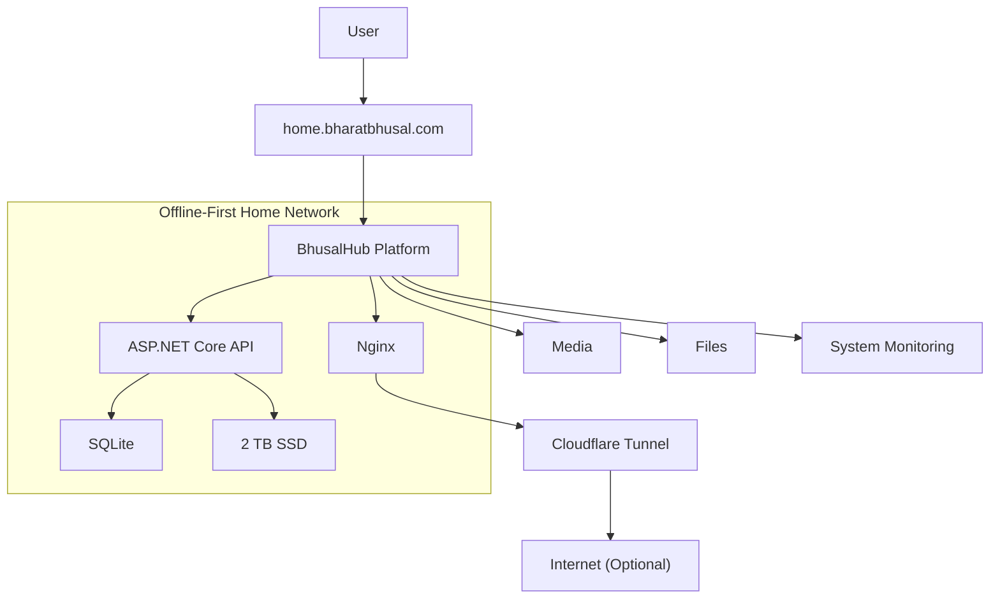

### Chapter 01 — Platform Identity

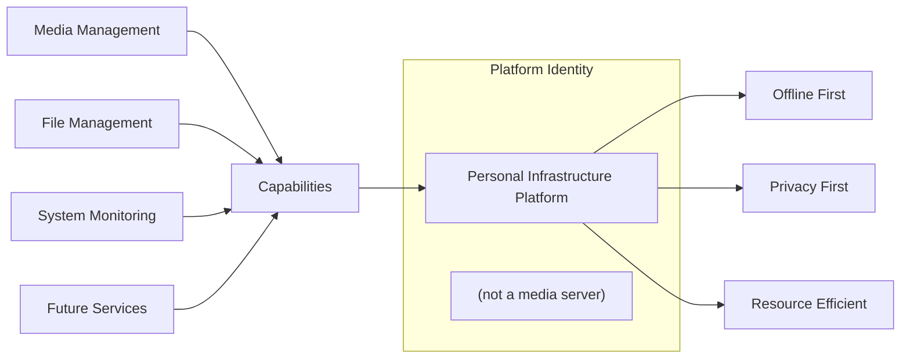

### Chapter 02 — Actors

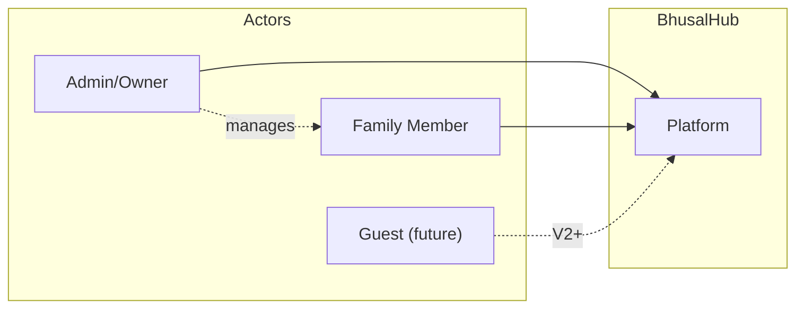

### Chapter 03 — NFR Hierarchy

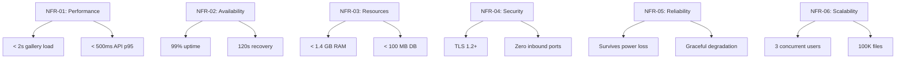

### Chapter 04 — Decision Flow

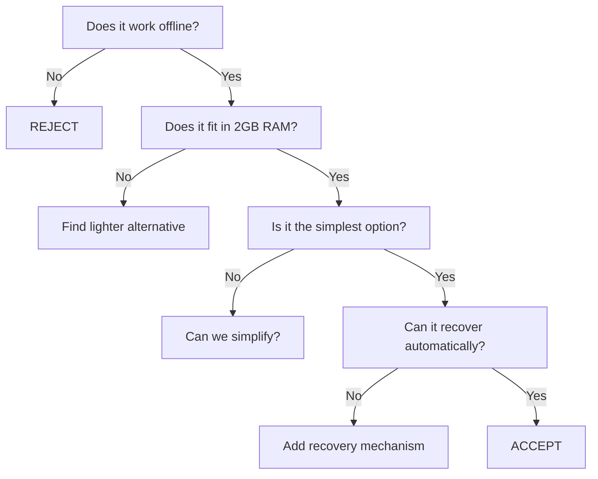

### Chapter 07 — System Context

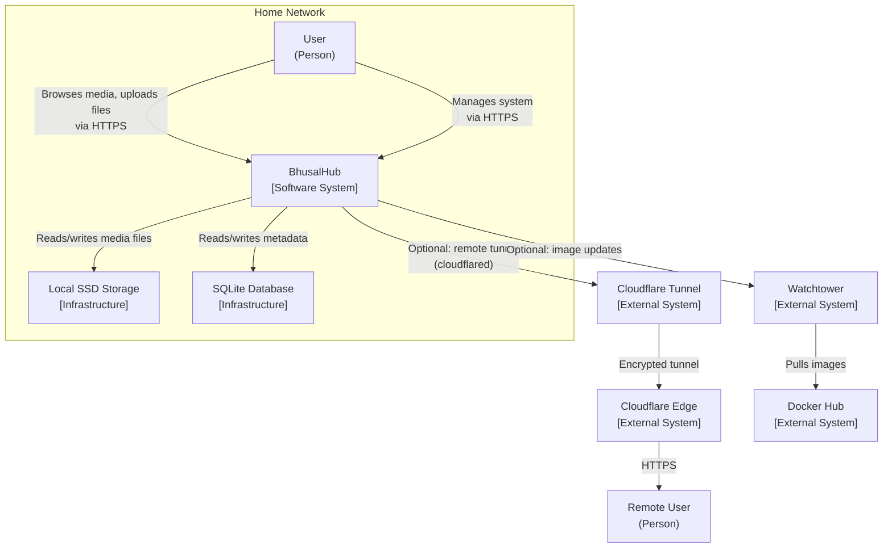

### Chapter 08 — Container Diagram

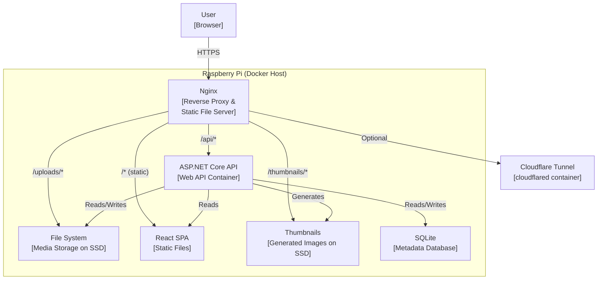

### Chapter 09 — Deployment Topology

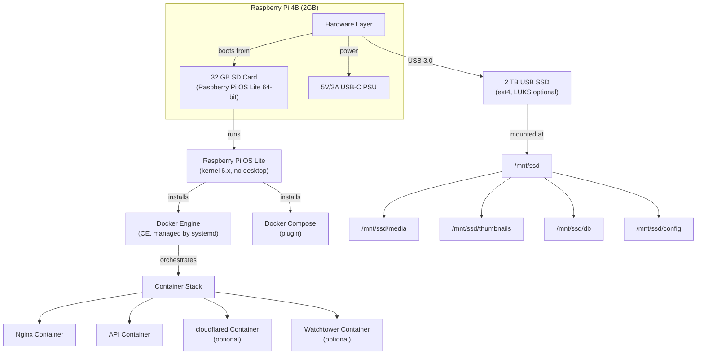

### Chapter 10 — Network Topology

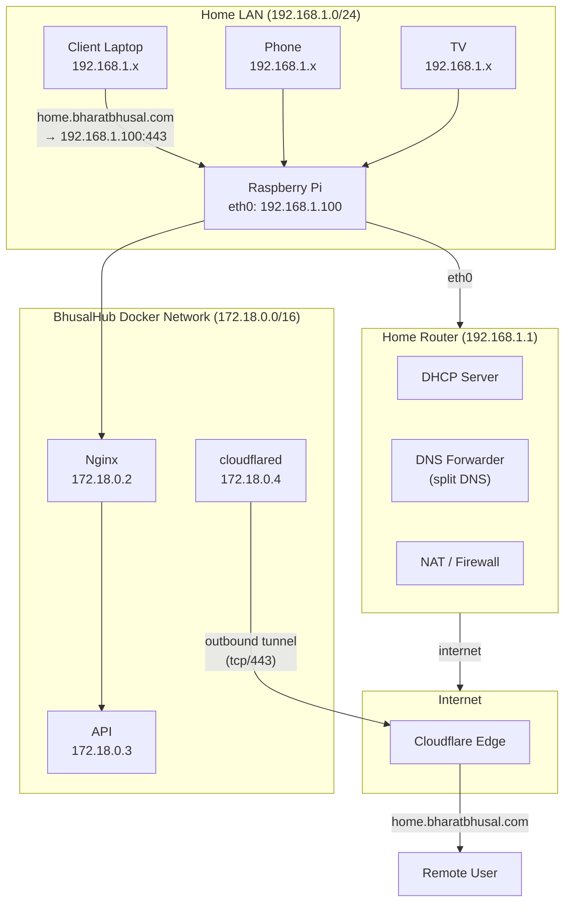

### Chapter 11 — Service Dependencies

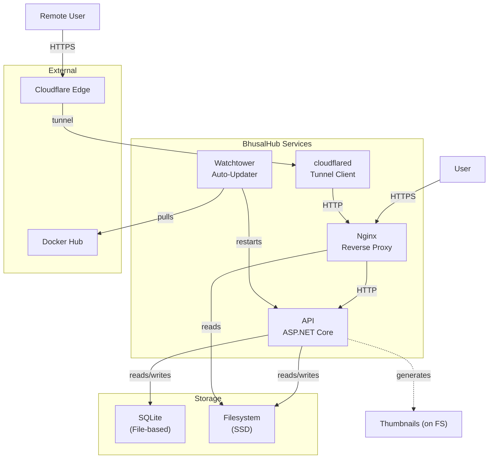

### Chapter 12 — Docker Stack

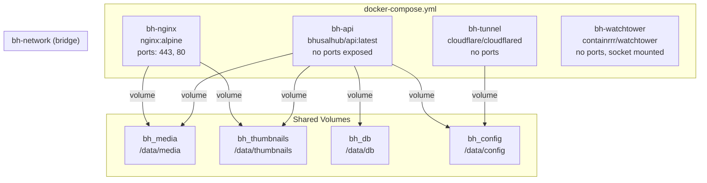

*For the full list of all diagrams, see the individual handbook chapters.*
