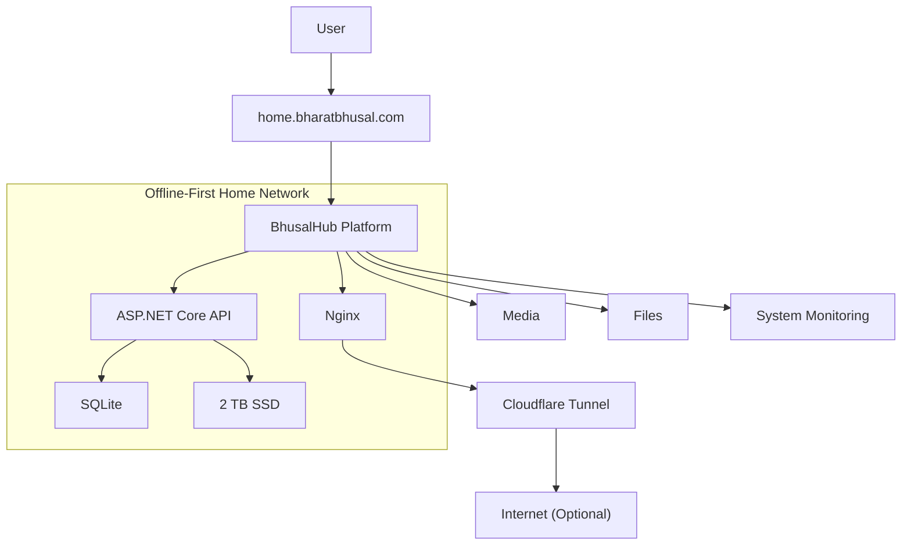

# 00 — Project Charter

**Status:** Draft  
**Last Updated:** 2026-07-08  
**Owner:** Bharat Bhusal  
**References:** [01 - Vision](../part-i-foundation/01-vision.md), [04 - Architecture Principles](../part-i-foundation/04-architecture-principles.md)

---

## 1. Purpose

BhusalHub exists to replace reliance on third-party cloud services with a personally owned, offline-capable infrastructure platform. It transforms a Raspberry Pi into a private cloud that serves media, files, and future self-hosted applications through a single secure portal — without requiring internet access for core functionality.

## 2. Vision Statement

Create a personal cloud ecosystem that behaves like a professionally managed SaaS application while remaining completely self-hosted, lightweight, and capable of operating entirely within a home network. Users interact with exactly one address — `https://home.bharatbhusal.com` — regardless of whether they are on the local network or accessing remotely.

## 3. Mission Statement

Build an offline-first, modular personal infrastructure platform that delivers media management, file access, and system services through a unified interface. Prioritize privacy, simplicity, and resilience over feature quantity. Establish a foundation that accommodates future self-hosted services without fundamental redesign.

## 4. Product Definition

BhusalHub is an offline-first, self-hosted personal infrastructure platform. It unifies media management, file access, infrastructure monitoring, and application hosting behind a single secure web portal. It is designed to run on a Raspberry Pi 4B (2 GB RAM) and serve a household of three simultaneous users.

> BhusalHub is NOT a media server. It is a Personal Infrastructure Platform. Media management is the first capability built on top of that platform. This distinction influences every architectural decision.

## 5. Design Philosophy

| Principle | Description |
|-----------|-------------|
| **Offline First** | Every core feature MUST function without internet access. The platform must be fully operational on the local network when the ISP is down. |
| **Privacy First** | All media remains on local storage. No cloud storage required. No external services involved in core functionality. |
| **Security by Default** | The Raspberry Pi is never exposed directly to the internet. Remote access uses an encrypted outbound tunnel. Authentication happens at the application layer. |
| **Lightweight** | Every architectural decision considers the 2 GB RAM constraint. Memory, CPU, and storage efficiency are not optional — they are requirements. |
| **Modular** | Services are independent components with clearly defined boundaries. Each can evolve without affecting others. |
| **Self-Healing** | After power restoration, the platform MUST become fully operational without manual intervention. Health monitoring continuously supervises services. |
| **Extensible** | The architecture MUST accommodate future services (AI search, OCR, home automation, git hosting) without fundamental redesign. |

## 6. Goals

1. Serve and organize personal photos, videos, and files on local storage.
2. Provide a unified dashboard for all platform services.
3. Function fully on the local network without internet connectivity.
4. Offer secure remote access via encrypted tunnel when internet is available.
5. Automatically recover from power failures.
6. Support three simultaneous household users comfortably.
7. Use less than 70% of available RAM during normal operation.
8. Minimize operational complexity — low maintenance, predictable behavior.

## 7. Non-Goals

1. NOT intended to replace enterprise NAS products (Synology, QNAP, TrueNAS).
2. NOT designed for hundreds of concurrent users.
3. NOT intended for internet-scale workloads.
4. NOT designed for public anonymous access.
5. NOT a Dropbox/Google Photos replacement in feature parity.
6. NOT a general-purpose compute platform.
7. NOT designed for real-time media transcoding at scale.
8. NOT intended to run on Windows or non-Linux platforms.

## 8. Success Criteria

| Criterion | Target |
|-----------|--------|
| Boot after power failure | Fully operational within 120 seconds of Pi boot |
| Offline functionality | All core features work with zero internet access |
| Memory usage | Less than 70% RAM usage during normal operation (idle + light usage) |
| Single entry point | Accessible ONLY through `https://home.bharatbhusal.com` — no IP/hostname access |
| Concurrent users | Supports 3 simultaneous household users without degradation |
| Media serving | Thumbnail loading under 500 ms for gallery views |
| Upload stability | Handles multi-GB uploads without timeout or corruption |
| Container uptime | Automatic restart within 30 seconds of any container failure |

## 9. Constraints

### Hardware

| Component | Specification |
|-----------|---------------|
| SoC | Raspberry Pi 4B (BCM2711) |
| RAM | 2 GB LPDDR4 |
| Primary storage | USB 3.0 SSD (2 TB) |
| Network | Gigabit Ethernet |
| Power | USB-C (5V/3A) |
| SD card | 32 GB (boot only — no application data) |

### Network

| Constraint | Detail |
|------------|--------|
| Local DNS | Router-level split DNS for `home.bharatbhusal.com` |
| Port forwarding | None — no inbound ports open |
| Outbound access | HTTPS only (443) for tunnel + updates |
| WiFi | Optional — wired Ethernet is the primary path |

### Software

| Constraint | Detail |
|------------|--------|
| Host OS | Raspberry Pi OS Lite (64-bit, no desktop) |
| Container runtime | Docker CE + Docker Compose |
| API runtime | ASP.NET Core 8 |
| Frontend | React + Vite (static, served by Nginx) |
| Database | SQLite (no separate database server) |
| Tunnel | Cloudflare Tunnel (cloudflared) |

### Budget

Zero recurring costs for core functionality. Optional domain registration and Cloudflare usage are under $20/year.

### Power

The platform MUST survive ungraceful power loss (no UPS assumed). Filesystem and database integrity after sudden power loss is a hard requirement.

## 10. Architecture Philosophy

Every design decision in BhusalHub is guided by this priority order:

1. **Works offline** — The platform must function when internet is absent.
2. **Survives power loss** — No data loss, no manual recovery, no fsck.
3. **Fits in 2 GB RAM** — If it doesn't fit, it doesn't ship.
4. **Minimal moving parts** — Fewer services means fewer failures.
5. **Simple to operate** — The owner should not need a DevOps background.

A decision that satisfies all five priorities is accepted without debate. A decision that conflicts with an earlier priority is rejected.

## 11. Target Users

| Role | Description |
|------|-------------|
| **Primary user** | Bharat Bhusal — platform owner, administrator, primary consumer |
| **Family members** | Household users consuming media and files |
| **Trusted guests** (future) | Limited access for external individuals |

All users in Version 1 are local network users. Remote access is limited to the primary user.

## 12. Supported Hardware

### Version 1 (Target)
- Raspberry Pi 4B, 2 GB RAM
- USB 3.0 SSD (2 TB)
- Home router with Gigabit Ethernet
- Optional: Raspberry Pi 5 (same architecture, more headroom)

### Future Compatibility
The architecture abstracts hardware details behind Docker and standard interfaces. Moving to a Raspberry Pi 5 or an x86 mini PC MUST NOT require architectural changes — only configuration updates.

## 13. High-Level Technology Stack

| Layer | Technology | Rationale |
|-------|------------|-----------|
| Frontend | React + Vite | Static generation, no runtime server, minimal memory footprint |
| API | ASP.NET Core 8 | Mature, performant, resource-efficient on ARM64 |
| Database | SQLite | Zero-administration, file-based, single-process — ideal for a 2 GB device |
| Web server | Nginx | Reverse proxy, static file serving, TLS termination |
| Containerization | Docker Compose | Declarative, version-controlled, self-healing via restart policies |
| Remote access | Cloudflare Tunnel | Encrypted outbound tunnel — no open ports |
| Auto-updates | Watchtower | Automatic container image updates |
| Monitoring | Custom health checks | Lightweight, no external monitoring dependency |

## 14. Project Scope (Version 1)

### Included

- Photo gallery with thumbnail grid view
- Video library with playback
- File browser with upload/download
- Album organization (create, manage, share)
- Thumbnail generation pipeline
- Full-text search across media metadata
- User authentication (local accounts)
- Unified dashboard
- Administrative interface (user management, system status)
- Docker Compose deployment
- Nginx reverse proxy with TLS
- Split DNS for `home.bharatbhusal.com`
- Cloudflare Tunnel for remote access
- Health monitoring and automatic container recovery
- Automatic startup after power restoration

### Excluded from V1

- AI-powered features (face recognition, object detection, semantic search)
- OCR and document indexing
- Mobile native applications (responsive web only)
- Home automation integration
- Multi-node clustering
- Federation with other instances
- Public sharing links

## 15. Future Scope

- AI-powered semantic media search
- Face recognition and person-based album organization
- Object detection and scene tagging
- OCR and full-text document indexing
- Home automation integration (Home Assistant)
- Git hosting (Gitea/Forgejo)
- Notes and knowledge management
- Personal dashboards and widgets
- IoT service integrations
- Mobile applications (iOS/Android)
- Multi-node clustering and replication
- Public sharing with access controls

## 16. Documentation Conventions

### RFC 2119

MUST, MUST NOT, REQUIRED, SHALL, SHALL NOT, SHOULD, SHOULD NOT, RECOMMENDED, MAY, and OPTIONAL carry their RFC 2119 meanings.

### Mermaid Diagrams

- All diagrams use Mermaid syntax compatible with GitHub Markdown rendering.
- Node labels containing spaces or special characters MUST be enclosed in double quotes: `U["User"]`.
- Subgraph titles MUST be double-quoted when they contain spaces.
- Every diagram MUST include a descriptive caption beneath it.

### Naming Conventions

| Artifact | Convention | Example |
|----------|------------|---------|
| Chapters | NN-lowercase-hyphenated.md | `00-project-charter.md` |
| ADRs | ADR-NNN | `ADR-001` |
| Environment variables | UPPER_SNAKE_CASE | `BH_DB_PATH` |
| Docker services | lowercase-hyphenated | `bh-api` |
| Git branches | type/short-description | `feat/thumbnail-pipeline` |

### Cross-References

Chapters are referenced as `[Chapter NN](path)` on first use in a document, and as `Chapter NN` on subsequent mentions.

### ADR Numbering

ADR numbers are sequential: ADR-001, ADR-002, etc. Each ADR is a single Markdown file or section within the ADR appendix.

### Versioning

This handbook follows SemVer 2.0.0. The `docs/README.md` file contains the current version. Individual chapters carry a status (Draft/Review/Approved) and last-updated date.

## 17. Repository Structure

```
BhusalHub/
├── docs/                   # Engineering handbook
│   ├── README.md           # Index and navigation
│   ├── templates/          # Reusable templates
│   ├── part-0-*/          # Project Charter
│   ├── part-i-*/          # Foundation
│   ├── part-ii-*/         # Architecture
│   ├── part-iii-*/        # Development
│   ├── part-iv-*/         # Operations
│   ├── part-v-*/          # Future
│   └── appendices/        # ADRs, schemas, references
├── src/
│   ├── frontend/           # React + Vite application
│   ├── backend/            # ASP.NET Core Web API
│   └── shared/             # Shared types, utilities
├── infra/
│   ├── docker/             # Dockerfiles per service
│   ├── compose/            # Docker Compose files
│   ├── nginx/              # Nginx configuration
│   └── scripts/            # Deployment and maintenance scripts
├── tests/
│   ├── frontend/           # Frontend unit/integration tests
│   └── backend/            # Backend unit/integration tests
├── .github/
│   └── workflows/          # CI/CD pipelines
├── .gitignore
├── LICENSE
└── README.md
```

## 18. Document Lifecycle

1. **Draft** — Initial writing, content under development.
2. **Review** — Content complete, pending verification against implementation.
3. **Approved** — Content vetted, matches implementation.
4. **Deprecated** — Superseded by a newer chapter or architectural change.
5. **Archived** — Historical reference only, no longer active.

When an architectural change occurs:
1. Identify affected handbook chapters.
2. Update chapters to reflect the new design.
3. If the change is significant, increment the handbook version.
4. Record the decision in an ADR.

The handbook is the authoritative source. If code contradicts the handbook, either the code or the handbook MUST be corrected — never both.

---

## 19. Identity Diagram



> **Caption:** BhusalHub identity diagram. The user connects to the single domain `home.bharatbhusal.com`. The platform serves media, files, and monitoring from local storage. Remote access flows through an optional Cloudflare Tunnel.
