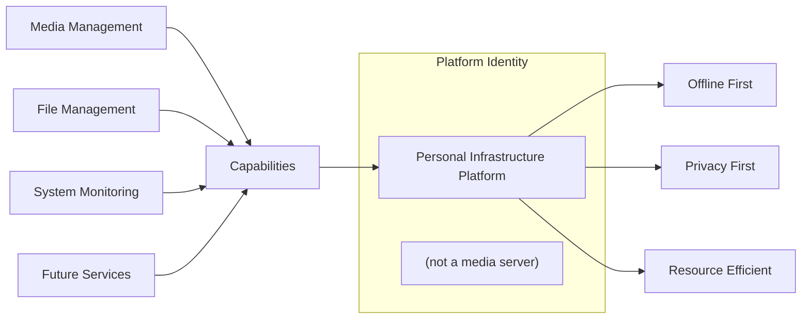

# 01 — Vision

**Status:** Draft  
**Last Updated:** 2026-07-08  
**Owner:** Bharat Bhusal  
**References:** [00 - Project Charter](../part-0-project-charter/00-project-charter.md), [04 - Architecture Principles](../part-i-foundation/04-architecture-principles.md)

---

## Purpose

Define the long-term vision for BhusalHub and establish the north star that guides all architectural and product decisions.

## Scope

The vision spans the full lifecycle of the project, from Version 1 through future extensions. It does not prescribe implementation details — those belong in later chapters.

## Vision Statement

> A personal cloud ecosystem that behaves like a professionally managed SaaS application while remaining completely self-hosted, lightweight, and operating entirely within a home network.

This vision rests on three pillars:

1. **Professional experience** — The UI, reliability, and performance should match what users expect from commercial services.
2. **Self-hosted ownership** — All data resides on personally owned hardware. No third party controls access.
3. **Offline capability** — The platform must never depend on internet availability for core functionality.

## Platform Identity

> **Caption:** BhusalHub is a platform first. Media management is one capability among many.

## Long-Term Horizon

| Horizon | Timeline | Capabilities |
|---------|----------|--------------|
| V1 | Now | Media management, files, monitoring, auth |
| V2 | 6–12 months | AI search, OCR, albums intelligence |
| V3 | 12–24 months | Home automation, git hosting, notes |
| V4 | 24+ months | Multi-node, mobile apps, federation |

## Key Differentiators

| vs. Commercial Cloud | vs. Traditional NAS |
|---------------------|---------------------|
| Data stays on your hardware | Modern UI, not a legacy web interface |
| No subscription costs | Designed for a single domain endpoint |
| Privacy by architecture | Containerized, not appliance-locked |
| Offline by default | Extensible beyond storage |

## Related Chapters

- [00 - Project Charter](../part-0-project-charter/00-project-charter.md)
- [04 - Architecture Principles](04-architecture-principles.md)
- [35 - Roadmap](../part-v-future/35-roadmap.md)
