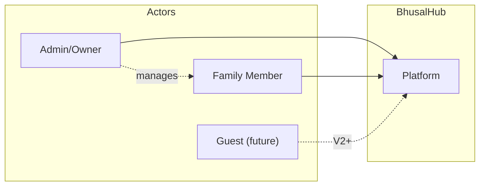

# 02 — Functional Requirements

**Status:** Draft  
**Last Updated:** 2026-07-08  
**Owner:** Bharat Bhusal  
**References:** [03 - Non-Functional Requirements](03-non-functional-requirements.md), [24 - User Journeys](../part-iii-development/24-user-journeys.md)

---

## Purpose

Define what BhusalHub MUST do. Functional requirements describe behavior, not implementation.

## Scope

Version 1 requirements only. Future versions are captured in [36 - Future Extensions](../part-v-future/36-future-extensions.md).

## Users and Roles

> **Caption:** User roles in Version 1. Guest access is deferred to a future release.

## Requirements

### FR-01: Authentication

| ID | Requirement | Priority |
|----|-------------|----------|
| FR-01.1 | Users MUST authenticate via username and password | P0 |
| FR-01.2 | Passwords MUST be hashed using bcrypt or Argon2 | P0 |
| FR-01.3 | Sessions MUST expire after a configurable period | P0 |
| FR-01.4 | Admin user MUST be created during first-time setup | P0 |

### FR-02: Media Management

| ID | Requirement | Priority |
|----|-------------|----------|
| FR-02.1 | Users MUST be able to upload photos (JPEG, PNG, WebP) | P0 |
| FR-02.2 | Users MUST be able to upload videos (MP4, MOV) | P0 |
| FR-02.3 | Users MUST be able to browse media in a grid layout | P0 |
| FR-02.4 | Users MUST be able to view individual photos at full resolution | P0 |
| FR-02.5 | Users MUST be able to play videos in-browser | P0 |
| FR-02.6 | Thumbnails MUST be generated for all uploaded media | P0 |
| FR-02.7 | Users MUST be able to download original files | P0 |
| FR-02.8 | Users MUST be able to delete media | P0 |

### FR-03: Albums

| ID | Requirement | Priority |
|----|-------------|----------|
| FR-03.1 | Users MUST be able to create albums | P1 |
| FR-03.2 | Users MUST be able to add/remove media from albums | P1 |
| FR-03.3 | Albums MUST support a cover photo | P1 |
| FR-03.4 | Albums MUST support optional descriptions | P1 |

### FR-04: File Browser

| ID | Requirement | Priority |
|----|-------------|----------|
| FR-04.1 | Users MUST be able to navigate the filesystem tree | P0 |
| FR-04.2 | Users MUST be able to upload arbitrary files | P0 |
| FR-04.3 | Users MUST be able to download files | P0 |
| FR-04.4 | Users MUST be able to create folders | P1 |
| FR-04.5 | Users MUST be able to rename files and folders | P1 |
| FR-04.6 | Users MUST be able to delete files and folders | P0 |

### FR-05: Search

| ID | Requirement | Priority |
|----|-------------|----------|
| FR-05.1 | Users MUST be able to search by filename | P0 |
| FR-05.2 | Users SHOULD be able to search by file type | P1 |
| FR-05.3 | Users SHOULD be able to search by date range | P1 |

### FR-06: Dashboard

| ID | Requirement | Priority |
|----|-------------|----------|
| FR-06.1 | The dashboard MUST display system status | P0 |
| FR-06.2 | The dashboard MUST display storage usage | P0 |
| FR-06.3 | The dashboard MUST display recent uploads | P1 |
| FR-06.4 | The dashboard SHOULD display service health | P1 |

### FR-07: Administration

| ID | Requirement | Priority |
|----|-------------|----------|
| FR-07.1 | Admin MUST be able to view registered users | P1 |
| FR-07.2 | Admin MUST be able to create/disable user accounts | P1 |
| FR-07.3 | Admin MUST be able to view system logs | P1 |
| FR-07.4 | Admin MUST be able to trigger thumbnail regeneration | P2 |

### FR-08: Remote Access

| ID | Requirement | Priority |
|----|-------------|----------|
| FR-08.1 | The platform MUST support remote access via Cloudflare Tunnel | P0 |
| FR-08.2 | Remote access MUST use the same domain as local access | P0 |
| FR-08.3 | Remote access MUST NOT require open inbound ports | P0 |

### FR-09: Self-Healing

| ID | Requirement | Priority |
|----|-------------|----------|
| FR-09.1 | All containers MUST restart automatically on failure | P0 |
| FR-09.2 | The platform MUST become operational after power loss without manual intervention | P0 |
| FR-09.3 | Health checks MUST run at least every 60 seconds | P1 |

## Priority Definitions

| Priority | Meaning |
|----------|---------|
| P0 | Required for V1. Platform is incomplete without it. |
| P1 | Important but deferrable to a V1.x release. |
| P2 | Nice to have. Included only if time and resources permit. |

## Related Chapters

- [03 - Non-Functional Requirements](03-non-functional-requirements.md)
- [24 - User Journeys](../part-iii-development/24-user-journeys.md)
- [36 - Future Extensions](../part-v-future/36-future-extensions.md)
