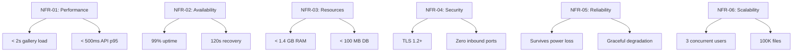

# 03 — Non-Functional Requirements

**Status:** Draft  
**Last Updated:** 2026-07-08  
**Owner:** Bharat Bhusal  
**References:** [02 - Functional Requirements](02-functional-requirements.md), [30 - Performance](../part-iv-operations/30-performance.md), [31 - Raspberry Pi Optimization](../part-iv-operations/31-raspberry-pi-optimization.md)

---

## Purpose

Define the quality attributes that govern how BhusalHub behaves. These requirements are as important as functional requirements — violating a non-functional requirement is a defect.

## Requirements

### NFR-01: Performance

| ID | Requirement | Target | Measurement |
|----|-------------|--------|-------------|
| NFR-01.1 | Gallery page load (30 thumbnails) | < 2 seconds | Browser DevTools, cold cache |
| NFR-01.2 | Full-resolution image load | < 3 seconds | Browser DevTools |
| NFR-01.3 | Video start playback | < 5 seconds | Time from click to first frame |
| NFR-01.4 | API response time (p95) | < 500 ms | API middleware timing |
| NFR-01.5 | Thumbnail generation (per image) | < 1 second | Processing log |
| NFR-01.6 | Search results | < 3 seconds | Query execution time |
| NFR-01.7 | Concurrent upload throughput | > 10 MB/s | Network monitoring |

### NFR-02: Availability

| ID | Requirement | Target |
|----|-------------|--------|
| NFR-02.1 | Platform uptime target | 99% (excluding planned maintenance) |
| NFR-02.2 | Time to recovery after power loss | < 120 seconds from Pi boot |
| NFR-02.3 | Container restart time | < 30 seconds from failure detection |
| NFR-02.4 | Scheduled maintenance window | Monthly, < 15 minutes |

### NFR-03: Resource Utilization

| ID | Requirement | Target |
|----|-------------|--------|
| NFR-03.1 | Idle RAM usage (all containers) | < 800 MB |
| NFR-03.2 | Normal operation RAM usage | < 1.4 GB (70% of 2 GB) |
| NFR-03.3 | Peak RAM usage | < 1.8 GB (90% threshold triggers alert) |
| NFR-03.4 | CPU idle usage | < 10% |
| NFR-03.5 | Thumbnail generation CPU | Burst to 100%, must not starve other services |
| NFR-03.6 | SQLite database size | < 100 MB (metadata only — no blobs) |
| NFR-03.7 | Docker image storage | < 2 GB for all images |

### NFR-04: Security

| ID | Requirement | Details |
|----|-------------|---------|
| NFR-04.1 | All communication MUST be encrypted | TLS 1.2+ for all HTTP traffic |
| NFR-04.2 | No open inbound ports | Zero port forwarding rules |
| NFR-04.3 | Authentication required for all endpoints | No anonymous access |
| NFR-04.4 | Password storage | bcrypt or Argon2, minimum cost factor 12 |
| NFR-04.5 | Session tokens | Cryptographically random, HTTP-only cookies |
| NFR-04.6 | File upload validation | MIME type verification, size limits, path traversal prevention |

### NFR-05: Reliability

| ID | Requirement | Details |
|----|-------------|---------|
| NFR-05.1 | Data integrity after power loss | SQLite WAL mode, fsync on critical writes |
| NFR-05.2 | Graceful degradation | If tunnel is down, local access continues unaffected |
| NFR-05.3 | Upload resilience | Resumable uploads for files > 100 MB |
| NFR-05.4 | No silent data loss | All write operations MUST be confirmed before returning success |

### NFR-06: Scalability

| ID | Requirement | Details |
|----|-------------|---------|
| NFR-06.1 | Concurrent users | 3 simultaneous users without degradation |
| NFR-06.2 | Media library size | Up to 100,000 files without index degradation |
| NFR-06.3 | Single file size | Up to 4 GB per file (FAT32 limit) |
| NFR-06.4 | Total storage | Up to 2 TB |

### NFR-07: Maintainability

| ID | Requirement | Details |
|----|-------------|---------|
| NFR-07.1 | Configuration via environment variables | No config files inside containers |
| NFR-07.2 | Single-command deployment | `docker compose up -d` |
| NFR-07.3 | Logs to stdout/stderr | Container-native logging |
| NFR-07.4 | Health check endpoints | Every service MUST expose `/health` |

### NFR-08: Portability

| ID | Requirement | Details |
|----|-------------|---------|
| NFR-08.1 | Must run on ARM64 | Raspberry Pi 4B/5 |
| NFR-08.2 | Must run on x86_64 | Development machines, future upgrades |
| NFR-08.3 | No platform-specific dependencies | All dependencies MUST be containerized |

## Requirements Hierarchy

> **Caption:** Non-functional requirements hierarchy. Each requirement has measurable targets.

## Conflict Resolution

When NFRs conflict, the priority order is:

1. **Reliability** — Data integrity is non-negotiable.
2. **Security** — A breach is worse than slow performance.
3. **Resource Utilization** — Must fit in 2 GB RAM.
4. **Availability** — Must recover automatically.
5. **Performance** — Target-driven, can degrade under load.
6. **Scalability** — Design for target, not theoretical max.

## Related Chapters

- [02 - Functional Requirements](02-functional-requirements.md)
- [30 - Performance](../part-iv-operations/30-performance.md)
- [31 - Raspberry Pi Optimization](../part-iv-operations/31-raspberry-pi-optimization.md)
