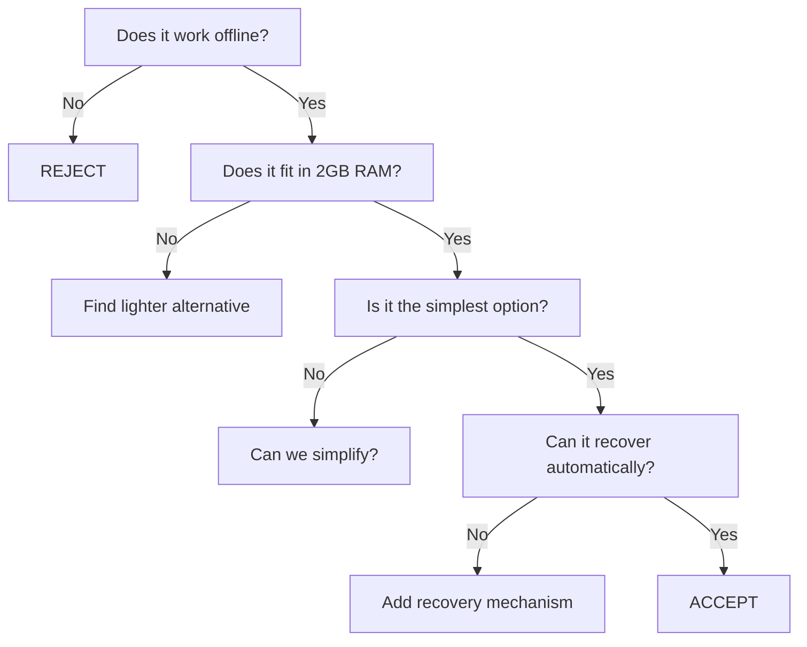

# 04 — Architecture Principles

**Status:** Draft  
**Last Updated:** 2026-07-08  
**Owner:** Bharat Bhusal  
**References:** [00 - Project Charter](../part-0-project-charter/00-project-charter.md), [08 - High-Level Design](../part-ii-architecture/08-high-level-design.md)

---

## Purpose

Define the architectural principles that guide every design decision. These principles are the rules of the road — any proposal that violates a principle MUST provide a compelling exception.

## Principles

### P-01: Offline First

The platform MUST function without internet access. Every core feature must work on the local network.

**Rationale:** The primary use case is a home network. Internet is a convenience, not a requirement.

**Implications:**
- All authentication MUST work locally (no OIDC provider dependency).
- All media storage and metadata MUST be local.
- The tunnel is the only internet-dependent component, and its failure MUST NOT affect local access.
- DNS resolution for `home.bharatbhusal.com` MUST work via local split DNS.

### P-02: Single Entry Point

All access flows through exactly one domain: `https://home.bharatbhusal.com`.

**Rationale:** A single canonical URL eliminates confusion, simplifies TLS management, and enables seamless local/remote切换.

**Implications:**
- Nginx MUST be the only public-facing process.
- All services MUST be reverse-proxied.
- Direct access by IP, port, or hostname MUST be blocked.
- Split DNS MUST resolve the domain to the internal IP on the LAN, and to Cloudflare externally.

### P-03: Privacy by Architecture

All user data resides on local storage. No cloud storage is used for primary data.

**Rationale:** The platform exists to eliminate reliance on third-party cloud services.

**Implications:**
- Thumbnails, metadata, and database are all local.
- The Cloudflare Tunnel carries encrypted traffic but Cloudflare cannot decrypt it (TLS is terminated at Nginx, not Cloudflare).
- No telemetry, analytics, or usage data leaves the network.
- Watchtower is the only service that communicates externally (for image updates), and it is optional.

### P-04: Resource Conscious

Every architectural decision considers the 2 GB RAM constraint.

**Rationale:** The target hardware has fixed resources. Running out of memory causes crashes that violate reliability requirements.

**Implications:**
- SQLite over PostgreSQL (no separate server process).
- Static frontend over SSR (no Node.js runtime in production).
- Simple thumbnail processing over a full media server (no Jellyfin/Plex).
- No Java or Python runtimes in the critical path.
- Alpine-based Docker images preferred.

### P-05: Modular Services

Each service has a single responsibility and communicates via HTTP.

**Rationale:** Modularity allows independent evolution, testing, and replacement.

**Implications:**
- No tight coupling between frontend and backend.
- Each service has its own Dockerfile and health check.
- Services communicate via REST over the Docker network.
- No shared databases between services.
- A service can be replaced without affecting others as long as the API contract is preserved.

### P-06: Self-Healing

The platform MUST recover from failures without human intervention.

**Rationale:** The Pi is headless and often inaccessible. Manual recovery is not acceptable.

**Implications:**
- Docker restart policies on all containers (`unless-stopped` or `always`).
- Health checks on every service.
- Automatic restart of unhealthy containers.
- SQLite WAL mode for crash recovery.
- Filesystem-level journaling on the SSD.

### P-07: Simple Over Clever

The simplest correct solution is preferred.

**Rationale:** Complex solutions increase maintenance burden, introduce failure modes, and make debugging harder. The operator is not a dedicated SRE.

**Implications:**
- Synchronous operations over event-driven patterns where latency allows.
- File-based storage over object storage (no MinIO).
- SQLite over a client-server database.
- Sequential thumbnail processing over a job queue (initially).
- README instructions over a dedicated deployment tool.

## Principle Decision Flow

> **Caption:** Decision flow for evaluating architectural choices against project principles.

## When Principles Conflict

1. **Offline First** overrides all other principles.
2. **Resource Conscious** overrides Modular Services (a monolith is acceptable if decomposition wastes memory).
3. **Simple Over Clever** is the tiebreaker.
4. **Privacy by Architecture** cannot be overridden — it is a hard constraint.

## Related Chapters

- [00 - Project Charter](../part-0-project-charter/00-project-charter.md)
- [08 - High-Level Design](../part-ii-architecture/08-high-level-design.md)
- [05 - Technology Decisions](05-technology-decisions.md)
