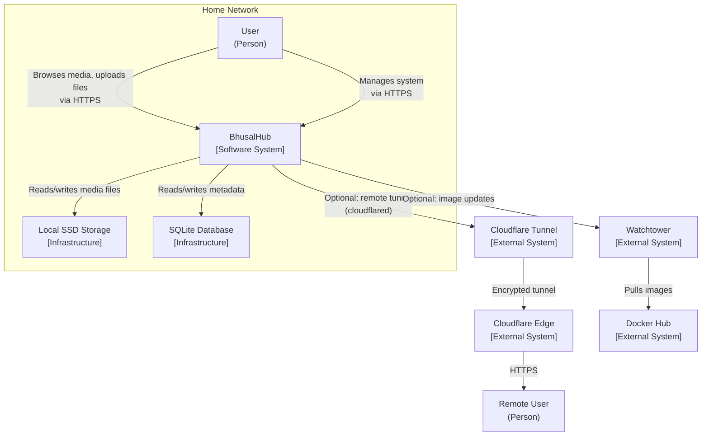

# 07 — System Context

**Status:** Draft  
**Last Updated:** 2026-07-08  
**Owner:** Bharat Bhusal  
**References:** [08 - High-Level Design](08-high-level-design.md), [10 - Network Architecture](10-network-architecture.md)

---

## Purpose

Define the boundary of the BhusalHub system and its interactions with external actors. This is the C4 Model Level 1 context diagram.

## Scope

The system boundary and external dependencies. Internal architecture is covered in [Chapter 08](08-high-level-design.md).

## System Context Diagram

> **Caption:** C4 Level 1 context diagram. BhusalHub is the central system. Users interact through a browser. Local storage and SQLite are internal infrastructure. Cloudflare Tunnel and Watchtower are optional external dependencies.

## Actors

| Actor | Type | Description |
|-------|------|-------------|
| **User** | Person | A household member accessing the platform through a web browser. May be an admin or standard user. |
| **Remote User** | Person | A user (typically the owner) accessing the platform from outside the home network via Cloudflare Tunnel. |
| **Cloudflare Tunnel** | External System | Provides secure remote access via outbound encrypted tunnel. No inbound ports required. |
| **Cloudflare Edge** | External System | Cloudflare's global network. Terminates TLS and forwards traffic to the tunnel. |
| **Watchtower** | External System | Periodically checks for container image updates and restarts containers with new images. |
| **Docker Hub** | External System | Container image registry. Watchtower pulls updated images from here. |

## System Responsibilities

- Serve the web UI (React static files).
- Expose the REST API for media operations.
- Store and retrieve media files from local SSD.
- Store and query metadata in SQLite.
- Generate thumbnails for uploaded media.
- Authenticate users and manage sessions.
- Serve media files for streaming/download.
- Report system health and status.

## External Dependencies

| Dependency | Required for | Failure impact | Notes |
|------------|-------------|----------------|-------|
| Local SSD | All media operations | Platform is non-functional | Critical |
| Cloudflare Tunnel | Remote access | Local access unaffected | Optional |
| Docker Hub | Watchtower updates | Existing images continue working | Optional |
| Internet connectivity | Remote access + updates | Local access unaffected | Optional |

## Related Chapters

- [08 - High-Level Design](08-high-level-design.md)
- [10 - Network Architecture](10-network-architecture.md)
- [17 - Tunnel Architecture](17-tunnel-architecture.md)
