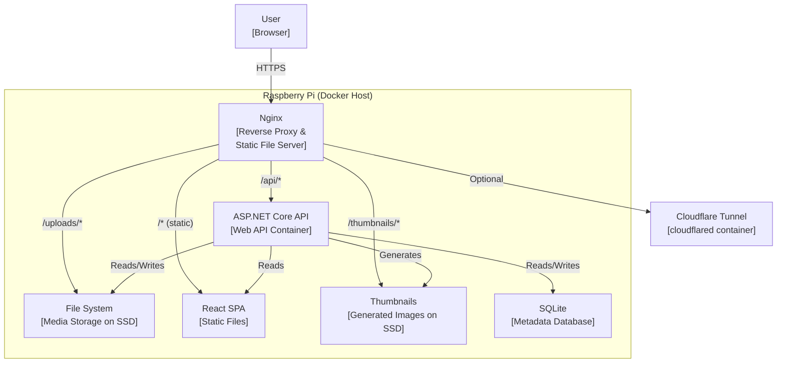

# 08 — High-Level Design

**Status:** Draft  
**Last Updated:** 2026-07-08  
**Owner:** Bharat Bhusal  
**References:** [07 - System Context](07-system-context.md), [11 - Service Architecture](11-service-architecture.md), [12 - Docker Architecture](12-docker-architecture.md)

---

## Purpose

Describe the container-level architecture of BhusalHub. This is the C4 Model Level 2 — the major runtime containers and their interactions.

## Scope

The internal structure of BhusalHub: processes, containers, data stores, and communication paths.

## Container Diagram

> **Caption:** C4 Level 2 container diagram. Nginx is the single entry point. The API handles business logic. Static files are served directly by Nginx.

## Container Responsibilities

### Nginx

- Terminates TLS (or passes through for local HTTP).
- Serves static SPA files directly (no Node.js runtime).
- Routes `/api/*` requests to the API container.
- Serves `/uploads/*` files directly (X-Accel-Redirect for authenticated access).
- Serves `/thumbnails/*` directly.
- Blocks all requests that do not match known routes.

### ASP.NET Core API

- Handles all business logic.
- Manages authentication and sessions.
- Processes media uploads (validation, storage, thumbnail generation).
- Serves media metadata (search, browse, albums).
- Exposes health check endpoints.
- Generates thumbnails (ImageSharp for images, FFmpeg for videos).

### SQLite Database

- Stores metadata: users, media records, albums, sessions.
- Stored on the SSD as a single file (`bhusalhub.db`).
- WAL mode for crash recovery.
- No separate server process — accessed directly by the API container.

### React SPA

- Static HTML/CSS/JS files built by Vite.
- Served directly by Nginx.
- Client-side routing via React Router.
- Communicates with the API via fetch/XHR.

### File System (SSD)

- `/data/media/` — Original uploaded files.
- `/data/thumbnails/` — Generated thumbnails.
- `/data/db/` — SQLite database file.

### Cloudflare Tunnel

- Optional container (`cloudflared`).
- Establishes outbound tunnel to Cloudflare edge.
- Routes `home.bharatbhusal.com` traffic to Nginx.
- Only runs when remote access is configured.

## Communication

| From | To | Protocol | Port | Purpose |
|------|----|----------|------|---------|
| Browser | Nginx | HTTPS | 443 | All user traffic |
| Nginx | API | HTTP | 8080 | API proxy |
| Nginx | Filesystem | File I/O | — | Serving static files |
| API | SQLite | SQLite | — | Database queries |
| API | Filesystem | File I/O | — | Media storage/retrieval |
| Tunnel | Nginx | HTTP | 80 | Tunnel ingress |

## Key Design Decisions

1. **Nginx serves static files directly** — bypasses the API for file delivery, reducing load on the ASP.NET Core process.
2. **Thumbnails are pre-generated** — no on-the-fly resizing. Generated at upload time and stored as files.
3. **API talks directly to SQLite** — no ORM abstraction layer. The API uses raw ADO.NET or Dapper for efficiency.
4. **SPA is fully static** — no server-side rendering. All dynamic content is fetched from the API.

## Related Chapters

- [07 - System Context](07-system-context.md)
- [11 - Service Architecture](11-service-architecture.md)
- [12 - Docker Architecture](12-docker-architecture.md)
