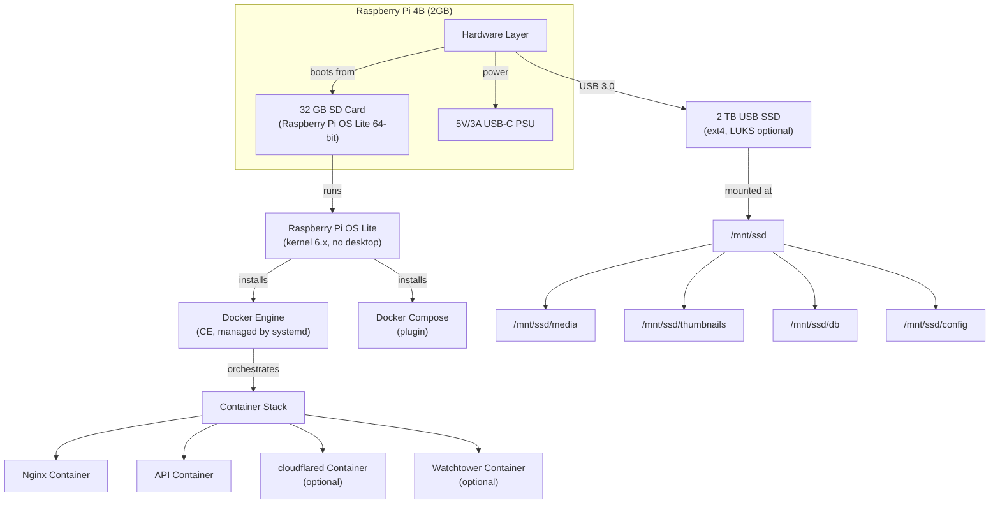

# 09 — Deployment Architecture

**Status:** Draft  
**Last Updated:** 2026-07-08  
**Owner:** Bharat Bhusal  
**References:** [12 - Docker Architecture](12-docker-architecture.md), [28 - Startup Lifecycle](../part-iv-operations/28-startup-lifecycle.md)

---

## Purpose

Describe how BhusalHub is deployed on the target hardware, including the physical and logical deployment topology.

## Scope

Single-node deployment on a Raspberry Pi 4B. Multi-node and cloud deployment are out of scope.

## Deployment Topology

> **Caption:** Deployment topology. The SD card holds the OS and Docker. The SSD holds all application data. Docker Compose manages all containers.

## Installation Overview

1. Flash Raspberry Pi OS Lite (64-bit) to SD card.
2. Enable SSH, configure WiFi (or wired), set hostname.
3. Install Docker CE and docker-compose-plugin.
4. Mount USB SSD at `/mnt/ssd`.
5. Copy `docker-compose.yml` and configuration to `/mnt/ssd/config/`.
6. Run `docker compose up -d`.
7. Configure router DNS for split-brain resolution.
8. (Optional) Configure Cloudflare Tunnel.

## Volume Mapping

| Container | Host Path (SSD) | Container Path |
|-----------|----------------|----------------|
| Nginx | `/mnt/ssd/media` | `/data/media` |
| Nginx | `/mnt/ssd/thumbnails` | `/data/thumbnails` |
| API | `/mnt/ssd/media` | `/data/media` |
| API | `/mnt/ssd/thumbnails` | `/data/thumbnails` |
| API | `/mnt/ssd/db` | `/data/db` |
| API | `/mnt/ssd/config` | `/app/config` |
| cloudflared | `/mnt/ssd/config/tunnel` | `/etc/cloudflared` |

## Network Layout

| Interface | CIDR | Purpose |
|-----------|------|---------|
| `eth0` | 192.168.1.0/24 | Home LAN (primary) |
| `docker0` | 172.17.0.0/16 | Docker bridge network |
| `bh-network` | 172.18.0.0/16 | BhusalHub internal network |

All BhusalHub containers communicate over the `bh-network` bridge. Only Nginx and cloudflared are exposed to the host network.

## Startup Order

1. OS boots (SD card).
2. systemd starts Docker daemon.
3. Docker Compose starts containers (enforced via `depends_on`):
   - SQLite is file-based, no container needed.
   - API starts first (creates/migrates DB on startup).
   - Nginx starts after API.
   - Cloudflared starts after Nginx (optional).
   - Watchtower starts last (optional).

## Related Chapters

- [12 - Docker Architecture](12-docker-architecture.md)
- [28 - Startup Lifecycle](../part-iv-operations/28-startup-lifecycle.md)
- [31 - Raspberry Pi Optimization](../part-iv-operations/31-raspberry-pi-optimization.md)
