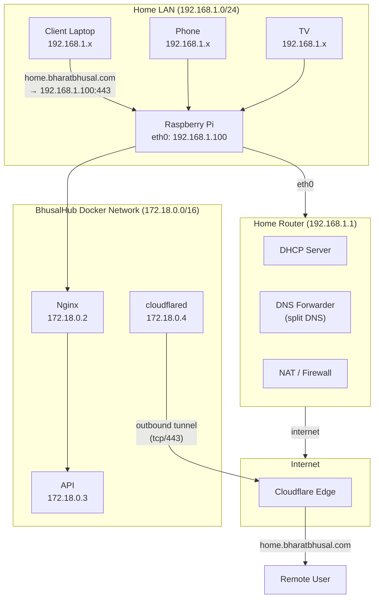

# 10 — Network Architecture

**Status:** Draft  
**Last Updated:** 2026-07-08  
**Owner:** Bharat Bhusal  
**References:** [16 - DNS Strategy](16-dns-strategy.md), [17 - Tunnel Architecture](17-tunnel-architecture.md), [18 - Security Architecture](18-security-architecture.md)

---

## Purpose

Describe the network topology, traffic flow, and isolation boundaries for BhusalHub.

## Scope

The home network, Docker internal networks, and the Cloudflare Tunnel. Physical cabling and router configuration.

## Network Topology

> **Caption:** Network topology. All LAN traffic flows to the Pi on port 443. Remote traffic enters through Cloudflare Tunnel. No inbound ports are open on the router.

## Traffic Flow

### Local Request

1. Client DNS lookup for `home.bharatbhusal.com`.
2. Router DNS returns `192.168.1.100` (local Pi IP).
3. Client sends HTTPS request to `192.168.1.100:443`.
4. Nginx receives request, routes to appropriate container.
5. Response flows back through Nginx to client.

### Remote Request

1. Client DNS lookup for `home.bharatbhusal.com`.
2. Public DNS returns Cloudflare edge IP.
3. Client sends HTTPS request to Cloudflare.
4. Cloudflare forwards to the tunnel (established from Pi).
5. `cloudflared` receives request, forwards to Nginx.
6. Nginx routes to appropriate container.
7. Response flows back through tunnel to Cloudflare to client.

## Network Rules

| Direction | Source | Destination | Port | Protocol | Purpose |
|-----------|--------|-------------|------|----------|---------|
| Inbound | LAN | Pi | 443 | TCP | HTTPS traffic |
| Inbound | LAN | Pi | 22 | TCP | SSH (admin, can be disabled) |
| Inbound | WAN | Router | — | — | All blocked (no port forwarding) |
| Outbound | Pi | Cloudflare | 443 | TCP | Tunnel connection |
| Outbound | Pi | Docker Hub | 443 | TCP | Watchtower image pulls |
| Outbound | Pi | NTP servers | 123 | UDP | Time synchronization |
| Outbound | Pi | DNS servers | 53 | UDP | DNS resolution |

## Docker Network

- All BhusalHub containers attach to `bh-network` (172.18.0.0/16).
- Communication between containers uses internal DNS (service names).
- Only Nginx and cloudflared are accessible from the host network.
- The API container has no exposed ports to the host — only Nginx can reach it.

## Security Boundaries

| Boundary | Trust Level | Protection |
|----------|-------------|------------|
| Internet | Untrusted | TLS, authentication, rate limiting |
| Cloudflare Tunnel | Semi-trusted | Tunnel token, application-layer auth |
| Home LAN | Trusted | Physical network, WiFi password |
| Docker network | Trusted | Docker bridge isolation |
| API | Trusted | Session authentication |

## Related Chapters

- [16 - DNS Strategy](16-dns-strategy.md)
- [17 - Tunnel Architecture](17-tunnel-architecture.md)
- [18 - Security Architecture](18-security-architecture.md)
