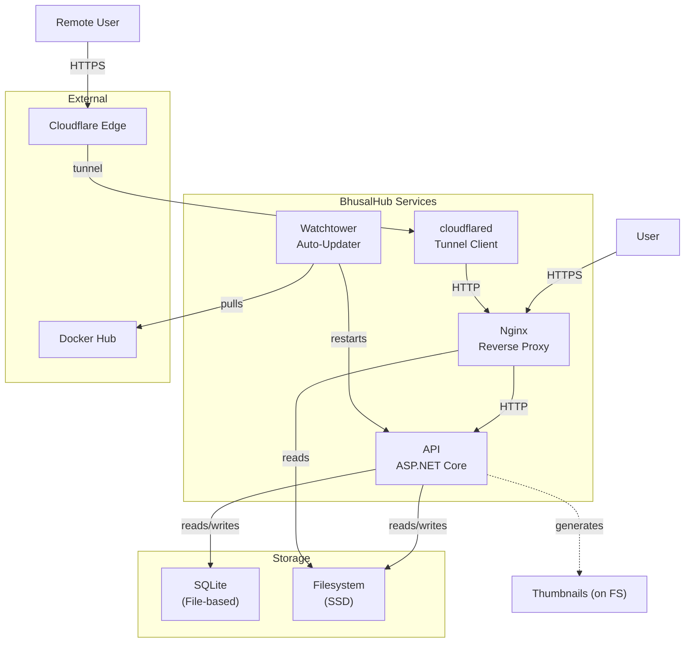

# 11 — Service Architecture

**Status:** Draft  
**Last Updated:** 2026-07-08  
**Owner:** Bharat Bhusal  
**References:** [08 - High-Level Design](08-high-level-design.md), [12 - Docker Architecture](12-docker-architecture.md), [21 - Backend Architecture](../part-iii-development/21-backend-architecture.md)

---

## Purpose

Define the internal service boundaries, their responsibilities, and how they communicate.

## Scope

The logical architecture of the services running inside Docker containers. Does not cover frontend internals (see [Chapter 20](../part-iii-development/20-frontend-architecture.md)).

## Service Dependency Graph

> **Caption:** Service dependency graph. Solid lines are runtime dependencies. Dashed lines indicate background processing.

## Service Specifications

### Nginx

- **Image:** `nginx:alpine`
- **Port:** 443 (HTTPS), 80 (HTTP redirect)
- **Health:** `http://localhost:80/health`
- **Dependencies:** API (for proxy), Filesystem (for static files)
- **Restart policy:** `unless-stopped`

### API

- **Image:** `bhusalhub/api` (built from source)
- **Port:** 8080 (internal only)
- **Health:** `http://localhost:8080/api/health`
- **Dependencies:** SQLite, Filesystem
- **Restart policy:** `unless-stopped`

### cloudflared

- **Image:** `cloudflare/cloudflared`
- **Port:** None (outbound only)
- **Health:** Tunnel connection status
- **Dependencies:** Nginx (tunnel routes to Nginx)
- **Restart policy:** `unless-stopped`

### Watchtower

- **Image:** `containrrr/watchtower`
- **Port:** None
- **Health:** N/A (runs on schedule)
- **Dependencies:** Docker socket
- **Restart policy:** `unless-stopped`

## Inter-Service Contracts

### Nginx → API

- Protocol: HTTP/1.1
- Base path: `http://api:8080`
- Routes:
  - `GET /api/health` — Health check
  - `GET /api/media` — Media list/search
  - `POST /api/media/upload` — Upload file
  - `GET /api/media/{id}` — Media details
  - `DELETE /api/media/{id}` — Delete media
  - `POST /api/auth/login` — Login
  - `POST /api/auth/logout` — Logout

### Nginx → Filesystem

- Serves static files for paths `/uploads/*`, `/thumbnails/*`.
- Files are served directly by Nginx for performance.
- Internal redirect (X-Accel-Redirect) used for authenticated access.

### API → SQLite

- Direct file I/O via Dapper/Micro-ORM.
- Database file at `/data/db/bhusalhub.db`.
- WAL mode enabled.
- Migrations run on API startup.

## Failure Isolation

| Failure | Impact | Isolation |
|---------|--------|-----------|
| API crashes | No dynamic content | Nginx returns 502. Restart via Docker. |
| SQLite corrupted | No metadata | API fails health check. Manual restore from backup. |
| Filesystem full | No uploads | API returns 507. Reads continue working. |
| Tunnel down | Remote access lost | Local access unaffected. |
| Watchtower fails | No auto-updates | Services continue on current images. |

## Related Chapters

- [08 - High-Level Design](08-high-level-design.md)
- [12 - Docker Architecture](12-docker-architecture.md)
- [21 - Backend Architecture](../part-iii-development/21-backend-architecture.md)
