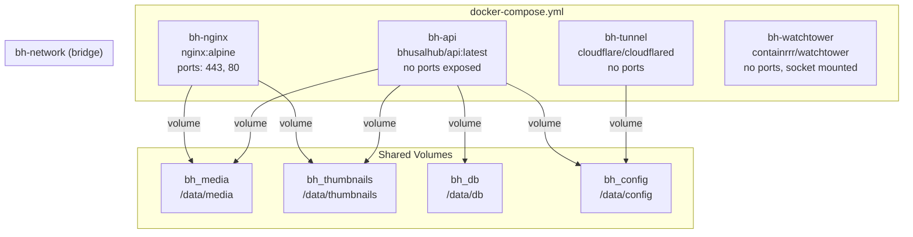

# 12 — Docker Architecture

**Status:** Draft  
**Last Updated:** 2026-07-08  
**Owner:** Bharat Bhusal  
**References:** [09 - Deployment Architecture](09-deployment-architecture.md), [11 - Service Architecture](11-service-architecture.md), [Appendix E](../appendices/e-docker-compose.md)

---

## Purpose

Describe the Docker Compose stack, container configuration, image strategy, and resource allocation.

## Scope

Docker Compose configuration, container images, resource limits, and networking. Single-node deployment only.

## Docker Stack Overview



> **Caption:** Docker Compose architecture. Three services sharing volumes and an internal network. Watchtower requires the Docker socket.

## Service Configuration

### bh-nginx

```yaml
image: nginx:alpine
ports:
  - "443:443"
  - "80:80"
volumes:
  - bh_media:/data/media:ro
  - bh_thumbnails:/data/thumbnails:ro
  - ./nginx.conf:/etc/nginx/nginx.conf:ro
  - ./ssl:/etc/nginx/ssl:ro
networks:
  - bh-network
depends_on:
  - bh-api
restart: unless-stopped
```

### bh-api

```yaml
image: bhusalhub/api:latest
build:
  context: ./src/backend
  dockerfile: Dockerfile
environment:
  - BH_DB_PATH=/data/db/bhusalhub.db
  - BH_MEDIA_ROOT=/data/media
  - BH_THUMBNAIL_ROOT=/data/thumbnails
volumes:
  - bh_media:/data/media
  - bh_thumbnails:/data/thumbnails
  - bh_db:/data/db
  - bh_config:/data/config
networks:
  - bh-network
restart: unless-stopped
```

### bh-tunnel

```yaml
image: cloudflare/cloudflared:latest
command: tunnel run
volumes:
  - bh_config:/etc/cloudflared:ro
networks:
  - bh-network
restart: unless-stopped
profiles:
  - remote-access
```

### bh-watchtower

```yaml
image: containrrr/watchtower:latest
volumes:
  - /var/run/docker.sock:/var/run/docker.sock
environment:
  - WATCHTOWER_CLEANUP=true
  - WATCHTOWER_SCHEDULE=0 0 4 * * *
restart: unless-stopped
profiles:
  - updates
```

## Image Strategy

| Service | Base Image | Size (approx) | Rationale |
|---------|-----------|---------------|-----------|
| Nginx | `nginx:alpine` | 25 MB | Smallest official Nginx image |
| API | `mcr.microsoft.com/dotnet/aspnet:8.0-alpine` | ~120 MB self-contained | AOT/trimmed publish for smaller size |
| Tunnel | `cloudflare/cloudflared` | ~20 MB | Official image, minimal |
| Watchtower | `containrrr/watchtower` | ~15 MB | Official image |

### API Image Optimization

- Published as a trimmed self-contained deployment.
- `dotnet publish --configuration Release --runtime linux-arm64 --self-contained true -p:PublishTrimmed=true -p:PublishSingleFile=true`
- Target framework: `net8.0`
- Multi-stage Docker build: SDK image for build, runtime image for production.

## Resource Limits

```yaml
services:
  bh-api:
    deploy:
      resources:
        limits:
          memory: 256M
        reservations:
          memory: 128M
  bh-nginx:
    deploy:
      resources:
        limits:
          memory: 64M
        reservations:
          memory: 32M
  bh-tunnel:
    deploy:
      resources:
        limits:
          memory: 64M
        reservations:
          memory: 32M
```

## Profiles

| Profile | Services | Use Case |
|---------|----------|----------|
| (default) | bh-nginx, bh-api | Minimal deployment |
| `remote-access` | + bh-tunnel | Enable remote access |
| `updates` | + bh-watchtower | Enable auto-updates |

Run `docker compose --profile remote-access up -d` to enable tunnels.

## Related Chapters

- [09 - Deployment Architecture](09-deployment-architecture.md)
- [11 - Service Architecture](11-service-architecture.md)
- [Appendix E - Docker Compose](../appendices/e-docker-compose.md)
- [28 - Startup Lifecycle](../part-iv-operations/28-startup-lifecycle.md)
