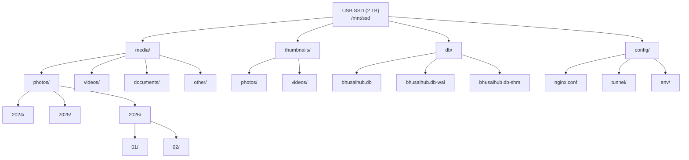

# 13 — Storage Architecture

**Status:** Draft  
**Last Updated:** 2026-07-08  
**Owner:** Bharat Bhusal  
**References:** [14 - Database Architecture](14-database-architecture.md), [22 - Thumbnail Processing](../part-iii-development/22-thumbnail-processing.md)

---

## Purpose

Describe how data is organized and stored on the USB SSD, including directory layout, file naming conventions, and storage policies.

## Scope

Physical storage layout on the SSD. Does not cover in-memory caching or database internals (see [Chapter 14](14-database-architecture.md)).

## Storage Hierarchy



> **Caption:** Storage directory layout. Media is organized by type and date. Thumbnails mirror the media structure. The database and configuration are in dedicated directories.

## Directory Layout

```
/mnt/ssd/
├── media/
│   ├── photos/
│   │   └── {year}/
│   │       └── {month}/
│   │           └── {uuid}.{ext}
│   ├── videos/
│   │   └── {year}/
│   │       └── {month}/
│   │           └── {uuid}.{ext}
│   ├── documents/
│   │   └── {uuid}.{ext}
│   └── other/
│       └── {uuid}.{ext}
├── thumbnails/
│   ├── photos/
│   │   └── {year}/
│   │       └── {month}/
│   │           └── {uuid}_thumb.jpg
│   └── videos/
│       └── {year}/
│           └── {month}/
│               └── {uuid}_thumb.jpg
├── db/
│   ├── bhusalhub.db
│   ├── bhusalhub.db-wal
│   └── bhusalhub.db-shm
└── config/
    ├── nginx/
    │   └── nginx.conf
    ├── tunnel/
    │   └── config.yml
    └── env/
        └── api.env
```

## File Naming Convention

Files are renamed on upload to ensure uniqueness and prevent path traversal:

```
{uuid}.{extension}
```

- UUID: Version 4 UUID (128-bit, random).
- Extension: Lowercased original extension (`.jpg`, `.mp4`, `.pdf`).

The original filename is preserved in the database metadata.

## Directory Organization

### Media Files (`/mnt/ssd/media/`)

Organized by type and upload date:
- `photos/` — Image files.
- `videos/` — Video files.
- `documents/` — PDF, DOCX, TXT, etc.
- `other/` — Everything else.

Within each type directory, files are stored in `{year}/{month}/` directories based on upload timestamp.

### Thumbnails (`/mnt/ssd/thumbnails/`)

Mirrors the media directory structure. Thumbnails are always JPEG, 320px wide, with `_thumb` suffix.

### Database (`/mnt/ssd/db/`)

Contains the SQLite database file and its WAL/SHM companions. This entire directory is backed up.

### Configuration (`/mnt/ssd/config/`)

Read-only configuration mounted into containers. Environment variable files define per-service configuration.

## Storage Policies

| Policy | Rule |
|--------|------|
| Maximum file size | 4 GB (FAT32 compatibility, also a practical ceiling) |
| Allowed file types | Images: jpg, jpeg, png, webp, gif, bmp, tiff. Videos: mp4, mov, avi, mkv. Documents: pdf, docx, xlsx, txt. |
| Thumbnail format | JPEG, quality 80, max dimension 320px |
| Database location | `/mnt/ssd/db/` — dedicated directory |
| Backup scope | Entire `/mnt/ssd/` directory |
| Retention | Original files are never modified. Deletion is user-initiated. |

## Backup Strategy

```
/mnt/ssd/              # FULL BACKUP
├── media/             # User data — backup priority 1
├── thumbnails/        # Regenerable — backup priority 2
├── db/                # Critical — backup priority 1
└── config/            # Recreatable — backup priority 3
```

- Thumbnails are regenerable from originals.
- Database is the only non-regenerable data (metadata, albums, user accounts).
- Config is version-controlled in the repository.

## Filesystem Considerations

- **Format:** ext4 (Raspberry Pi OS default for external drives).
- **Mount options:** `defaults,noatime,nodiratime` (reduce write amplification).
- **Journaling:** Enabled (ext4 default). Provides crash recovery.
- **Trim:** `fstrim` weekly cron job for SSD maintenance.

## Failure Scenarios

| Scenario | Impact | Mitigation |
|----------|--------|------------|
| SSD full | Uploads fail | API returns 507. Reads continue. Monitor disk usage. |
| SSD disconnect | Platform unavailable | Docker volumes break. Manual remount required. |
| Filesystem corruption | Data loss risk | Journaling + monthly fsck. Database has own WAL protection. |
| Accidental deletion | Data loss | Regular backups. No recycle bin in V1. |

## Related Chapters

- [14 - Database Architecture](14-database-architecture.md)
- [22 - Thumbnail Processing](../part-iii-development/22-thumbnail-processing.md)
- [33 - Disaster Recovery](../part-iv-operations/33-disaster-recovery.md)
