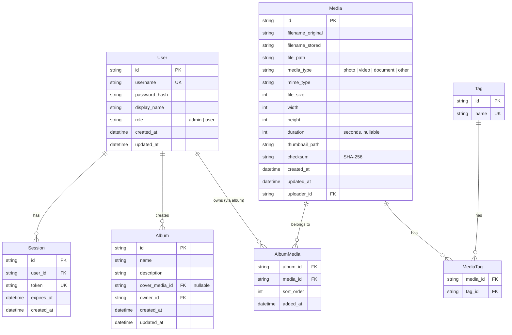

# 14 — Database Architecture

**Status:** Draft  
**Last Updated:** 2026-07-08  
**Owner:** Bharat Bhusal  
**References:** [13 - Storage Architecture](13-storage-architecture.md), [Appendix C - Database Schema](../appendices/c-database-schema.md)

---

## Purpose

Describe the database design, including table structure, relationships, indexing strategy, and operational considerations.

## Scope

The SQLite database schema and query patterns. Does not cover the API layer that accesses the database (see [Chapter 21](../part-iii-development/21-backend-architecture.md)).

## Entity Relationship Diagram



> **Caption:** Entity relationship diagram showing the core tables and their relationships.

## Table Descriptions

### User

Stores user accounts. Passwords are hashed with bcrypt (cost factor 12). The admin account is created during first-time setup.

### Session

Authentication sessions. Tokens are random 64-byte values, stored as SHA-256 hashes. Expired sessions are periodically cleaned up.

### Media

The central table. Stores metadata for every uploaded file. Dimensions and duration are extracted at upload time. The checksum enables duplicate detection. The `thumbnail_path` field caches the thumbnail location to avoid filesystem traversal.

### Album

User-created collections. The `cover_media_id` references the selected cover photo (nullable — defaults to the first added media).

### AlbumMedia

Join table with sort order. Albums preserve insertion order by default but support manual reordering via `sort_order`.

### Tag / MediaTag

Simple tagging system for future AI-powered tagging. Tags are shared across users.

## Indexing Strategy

| Table | Index | Type | Purpose |
|-------|-------|------|---------|
| Media | `idx_media_type` | B-tree | Filter by media type |
| Media | `idx_media_created` | B-tree | Sort by upload date |
| Media | `idx_media_uploader` | B-tree | Filter by uploader |
| Media | `idx_media_checksum` | B-tree | Duplicate detection |
| Session | `idx_session_token` | B-tree | Fast session lookup |
| Session | `idx_session_expires` | B-tree | Expired session cleanup |
| AlbumMedia | `pk_album_media` | Composite PK | Uniqueness + sort |
| MediaTag | `pk_media_tag` | Composite PK | Uniqueness |

## Query Patterns

### Read-Heavy

The workload is estimated at 80% reads, 20% writes. The gallery view performs:

```sql
SELECT id, filename_original, thumbnail_path, media_type, created_at
FROM Media
WHERE media_type IN ('photo', 'video')
ORDER BY created_at DESC
LIMIT 30 OFFSET :offset;
```

This is the hottest query in the system. The `idx_media_created` index covers it.

### Write Patterns

Writes are sequential (new uploads). No update-heavy patterns exist except album reordering.

## SQLite Configuration

```sql
PRAGMA journal_mode = WAL;           -- Write-Ahead Log for crash recovery + concurrent reads
PRAGMA synchronous = NORMAL;          -- Balance safety and speed (FULL is safer but slower)
PRAGMA cache_size = -8000;            -- 8 MB page cache
PRAGMA busy_timeout = 5000;           -- Wait 5s before throwing busy errors
PRAGMA foreign_keys = ON;             -- Enforce referential integrity
PRAGMA mmap_size = 268435456;         -- 256 MB memory-mapped I/O
PRAGMA temp_store = MEMORY;           -- Store temp tables in memory
```

## Migration Strategy

- Migrations are C# classes with `Up()` and `Down()` methods.
- Applied automatically on API startup.
- Migration order is sequential (timestamp-prefixed).
- The migration table `__Migrations` tracks applied migrations.

## Backup

- Database is backed up via `.backup` command while the application is running.
- Weekly cron job creates backup: `bhusalhub-{date}.db`.
- Backups are stored on the SSD (same device — off-device backup is manual).

## Failure Scenarios

| Scenario | Impact | Mitigation |
|----------|--------|------------|
| Database corruption | Metadata unavailable | WAL mode reduces risk. Restore from backup. |
| Busy/SQLITE_BUSY | Write contention | `busy_timeout=5000`. Single writer ensures this is rare. |
| Disk full | Write failure | API returns 507. Monitor disk usage with alert at 90%. |
| Migration failure | API fails to start | Roll back migration, fix, restart. |

## Related Chapters

- [13 - Storage Architecture](13-storage-architecture.md)
- [21 - Backend Architecture](../part-iii-development/21-backend-architecture.md)
- [Appendix C - Database Schema](../appendices/c-database-schema.md)
