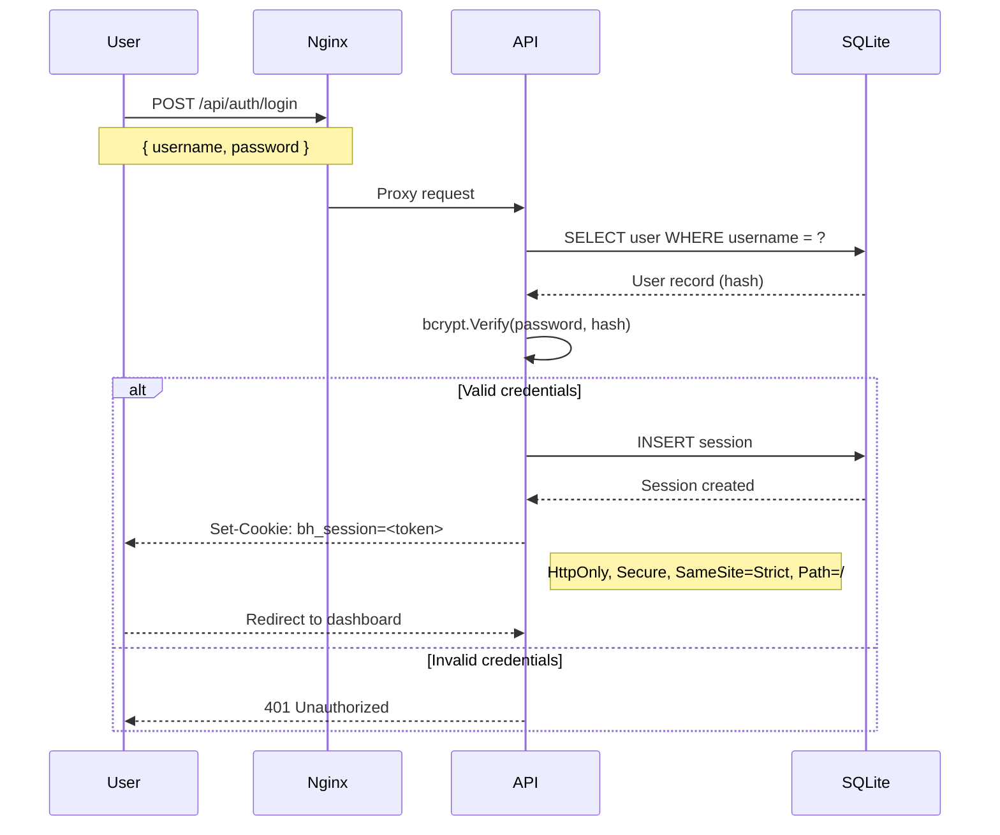
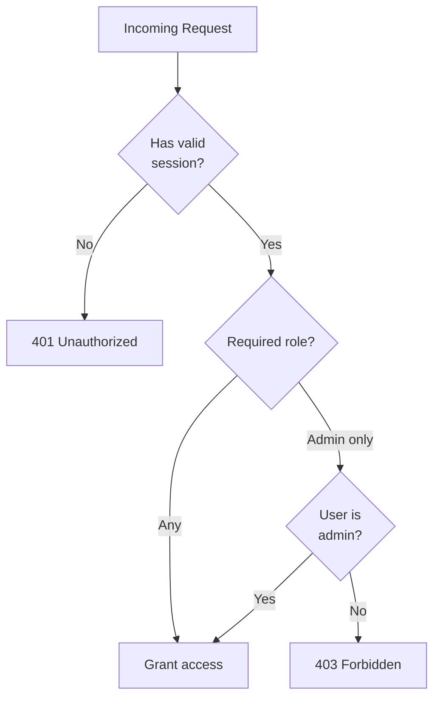

# 15 — Authentication

**Status:** Draft  
**Last Updated:** 2026-07-08  
**Owner:** Bharat Bhusal  
**References:** [14 - Database Architecture](14-database-architecture.md), [18 - Security Architecture](18-security-architecture.md), [23 - API Specification](../part-iii-development/23-api-specification.md)

---

## Purpose

Describe how users authenticate, how sessions are managed, and how authorization is enforced.

## Scope

Local authentication for the BhusalHub platform. Does not cover Cloudflare Tunnel authentication (see [Chapter 17](17-tunnel-architecture.md)).

## Authentication Flow



> **Caption:** Authentication sequence. Passwords are verified against bcrypt hashes. A session cookie is issued on success.

## Session Management

### Session Creation

1. User submits username and password via `POST /api/auth/login`.
2. API looks up user by username.
3. API verifies password hash with bcrypt.
4. On success, a session is created:
   - Session ID: UUIDv4.
   - Token: 64 random bytes.
   - Expiry: 24 hours (configurable).
5. Response sets `Set-Cookie` header.

### Session Validation

Every authenticated request includes the session cookie. The API:
1. Reads `bh_session` cookie.
2. Hashes the token value.
3. Looks up the hash in the Session table.
4. Checks expiry.
5. Attaches user identity to the request context.

### Session Expiry

- Default: 24 hours.
- Sliding: Reset on each authenticated request (configurable).
- Max lifetime: 7 days (forces re-login weekly).
- Expired sessions are cleaned up by a background job.

## Session Cookie

```
Set-Cookie: bh_session=<base64-encoded-token>;
  HttpOnly;
  Secure;
  SameSite=Strict;
  Path=/;
  Max-Age=86400
```

- `HttpOnly` — Not accessible via JavaScript.
- `Secure` — Only sent over HTTPS.
- `SameSite=Strict` — Not sent on cross-site requests.
- `Path=/` — Sent for all requests to the domain.

## Authorization



> **Caption:** Authorization flow. Every request is checked for a valid session. Admin endpoints require the admin role.

### Roles

| Role | Permissions |
|------|-------------|
| `admin` | Full access: manage users, view logs, system configuration, all media operations |
| `user` | Standard access: browse, upload, download, create albums, manage own content |

### Authorization by Endpoint

| Endpoint Pattern | Required Role |
|-----------------|---------------|
| `GET /api/media/*` | Any authenticated |
| `POST /api/media/upload` | Any authenticated |
| `DELETE /api/media/{id}` | Any authenticated (own uploads) or admin |
| `GET /api/admin/*` | Admin |
| `POST /api/admin/users` | Admin |
| `GET /api/health` | None (unauthenticated) |

## First-Time Setup

On first boot (no users exist in the database), the API:
1. Accepts `POST /api/setup` with admin credentials.
2. Creates the admin user.
3. Returns success.
4. All subsequent requests require authentication.

If a user already exists, `/api/setup` returns 404.

## Future Improvements

- **OAuth2/OIDC** — For SSO integration (deferred; not needed for local household use).
- **2FA/TOTP** — For admin account security (deferred; the Pi is not internet-exposed).
- **API tokens** — For programmatic access (deferred; no automation use cases in V1).

## Related Chapters

- [14 - Database Architecture](14-database-architecture.md)
- [18 - Security Architecture](18-security-architecture.md)
- [23 - API Specification](../part-iii-development/23-api-specification.md)
