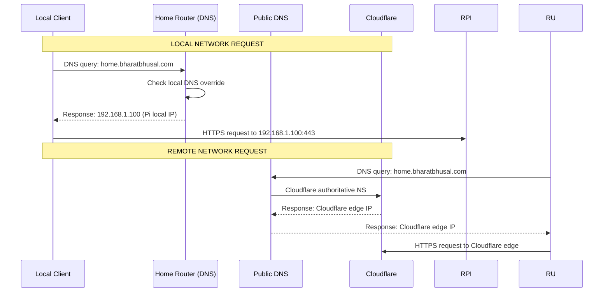

# 16 — DNS Strategy

**Status:** Draft  
**Last Updated:** 2026-07-08  
**Owner:** Bharat Bhusal  
**References:** [10 - Network Architecture](10-network-architecture.md), [17 - Tunnel Architecture](17-tunnel-architecture.md)

---

## Purpose

Describe how DNS resolution works for `home.bharatbhusal.com` from both local and remote networks, and how split DNS enables seamless access.

## Scope

DNS configuration on the home router, Cloudflare DNS, and the interaction between them.

## DNS Resolution Flow

> **Caption:** DNS resolution from local and remote networks. Local requests resolve to the Pi's internal IP. Remote requests resolve to Cloudflare's edge.

## Split DNS Configuration

Split DNS ensures that `home.bharatbhusal.com` resolves to different IPs depending on where the query originates:

| Network | Resolves to | Responsible |
|---------|-------------|-------------|
| Home LAN | `192.168.1.100` (Pi) | Router DNS |
| Remote (Internet) | Cloudflare edge IP | Cloudflare DNS |

## Router Configuration

The home router (typically a consumer router running OpenWrt or the manufacturer's firmware) MUST be configured with a DNS override:

| Setting | Value |
|---------|-------|
| Domain | `home.bharatbhusal.com` |
| IP Address | `192.168.1.100` |
| Type | A Record (Address) |
| Override | Must apply to all LAN clients |

**Note:** The exact configuration UI varies by router manufacturer. Some call this "DNS override", others "Local DNS", "Static DNS", or "DNS Rebind".

## Cloudflare DNS Configuration

In the Cloudflare dashboard for the `bharatbhusal.com` zone:

| Type | Name | Content | Proxy |
|------|------|---------|-------|
| CNAME | `home` | `{tunnel-id}.cfargotunnel.com` | Proxied (orange cloud) |

This delegates traffic to the Cloudflare Tunnel. The tunnel ID is generated when the tunnel is created via `cloudflared tunnel create`.

## TLS Certificate

Since all traffic terminates at Nginx (not Cloudflare), TLS certificates can be managed in two ways:

### Option A: Let's Encrypt (Recommended)

- API obtains certificates via `certbot` or `lego`.
- Certificates stored in `/mnt/ssd/config/ssl/`.
- Auto-renewal via cron job or sidecar container.
- Works offline for local access (cached certificates).

### Option B: Cloudflare Origin Certificates

- Free origin certificate from Cloudflare.
- 15-year validity.
- Requires Cloudflare proxy to be enabled.

## Failure Scenarios

| Scenario | Impact | Mitigation |
|----------|--------|------------|
| Router DNS misconfigured | Local users cannot resolve `home.bharatbhusal.com` | Fall back to Pi IP directly, or fix router DNS |
| Cloudflare DNS down | Remote access fails | No impact on local access |
| Tunnel down | Remote access fails | Local access works via router DNS → Pi IP |
| Internet down | Remote access fails | Local access works normally |

## Related Chapters

- [10 - Network Architecture](10-network-architecture.md)
- [17 - Tunnel Architecture](17-tunnel-architecture.md)
- [18 - Security Architecture](18-security-architecture.md)
