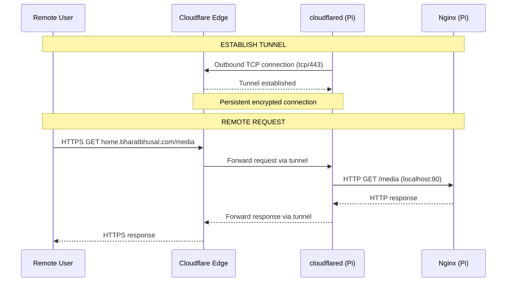

# 17 — Tunnel Architecture

**Status:** Draft  
**Last Updated:** 2026-07-08  
**Owner:** Bharat Bhusal  
**References:** [10 - Network Architecture](10-network-architecture.md), [16 - DNS Strategy](16-dns-strategy.md), [18 - Security Architecture](18-security-architecture.md)

---

## Purpose

Describe how Cloudflare Tunnel provides secure remote access to BhusalHub without opening inbound ports on the home network.

## Scope

Cloudflare Tunnel (cloudflared) configuration, tunnel lifecycle, and failure modes.

## Tunnel Architecture



> **Caption:** Tunnel request flow. The tunnel is an outbound connection from the Pi to Cloudflare. Traffic flows in both directions over this persistent connection.

## How It Works

1. `cloudflared` on the Pi establishes an outbound TCP connection to Cloudflare's edge network.
2. Cloudflare associates the tunnel with `home.bharatbhusal.com` (CNAME pointing to `{tunnel-id}.cfargotunnel.com`).
3. When a remote user requests `home.bharatbhusal.com`, Cloudflare routes the request through the tunnel.
4. `cloudflared` receives the request and forwards it to the local Nginx instance.
5. Nginx processes it as a normal local request.

## Configuration

### Tunnel Setup

```bash
# Install cloudflared
# Authenticate with Cloudflare
cloudflared tunnel login

# Create tunnel
cloudflared tunnel create bhusalhub

# Route domain to tunnel
cloudflared tunnel route dns bhusalhub home.bharatbhusal.com

# Run tunnel
cloudflared tunnel run bhusalhub
```

### Docker Compose Integration

```yaml
services:
  bh-tunnel:
    image: cloudflare/cloudflared:latest
    command: tunnel run
    volumes:
      - bh_config:/etc/cloudflared:ro
    networks:
      - bh-network
    restart: unless-stopped
    profiles:
      - remote-access
```

The tunnel token or credentials file is stored in `/mnt/ssd/config/tunnel/`.

## Security Properties

| Property | Detail |
|----------|--------|
| **No inbound ports** | The tunnel initiates an outbound connection. No port forwarding needed. |
| **Encrypted transport** | Traffic between Cloudflare and `cloudflared` is encrypted. |
| **Application-layer auth** | Users must still authenticate with username/password. |
| **Tunnel token** | The tunnel is authenticated by a Cloudflare-generated token. Without the token, the tunnel cannot be established. |
| **No public IP needed** | The Pi can be behind CGNAT or have a dynamic IP. |

## Failure Modes

| Scenario | Behavior | Recovery |
|----------|----------|----------|
| Tunnel disconnects | `cloudflared` automatically reconnects | Docker restart policy handles persistent failures |
| Internet outage | Tunnel unavailable | Local access continues via split DNS |
| Token expired | Tunnel fails to start | Requires `cloudflared tunnel login` again |
| Cloudflare outage | Remote access down | No recovery needed (local only) — incident at Cloudflare |

## Why Cloudflare Tunnel (Not Alternatives)

| Option | Status | Rationale |
|--------|--------|-----------|
| Cloudflare Tunnel | **Chosen** | Free tier sufficient, zero open ports, managed endpoint |
| WireGuard | Rejected | Requires port forwarding or public IP, more complex NAT traversal |
| Tailscale | Rejected | Requires Tailscale client on every remote device, mesh adds complexity |
| FRP | Rejected | Requires a VPS, additional cost, more maintenance |
| Port forwarding | Rejected | Security risk — directly exposes the Pi |

## Related Chapters

- [10 - Network Architecture](10-network-architecture.md)
- [16 - DNS Strategy](16-dns-strategy.md)
- [18 - Security Architecture](18-security-architecture.md)
