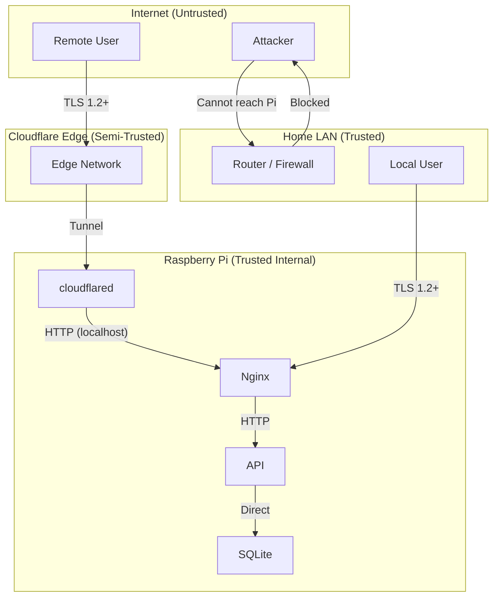

# 18 — Security Architecture

**Status:** Draft  
**Last Updated:** 2026-07-08  
**Owner:** Bharat Bhusal  
**References:** [10 - Network Architecture](10-network-architecture.md), [15 - Authentication](15-authentication.md), [17 - Tunnel Architecture](17-tunnel-architecture.md)

---

## Purpose

Document the security model, trust boundaries, and defensive measures for BhusalHub.

## Scope

Application-level security, network security, container security, and operational security. Physical security of the Raspberry Pi is out of scope.

## Security Boundaries

> **Caption:** Security boundaries. The Pi has no direct internet exposure. All inbound traffic passes through either the local router (LAN) or the Cloudflare Tunnel. Nginx is the only service exposed to either path.

## Defense Layers

### Layer 1: Network Security

| Measure | Detail |
|---------|--------|
| No port forwarding | Router has zero inbound port forwarding rules |
| Firewall | Router's NAT firewall blocks unsolicited inbound traffic |
| LAN isolation | WiFi client isolation (optional) prevents peer-to-peer access |
| Docker bridge isolation | Containers on `bh-network` are isolated from host network |

### Layer 2: Transport Security

| Measure | Detail |
|---------|--------|
| TLS 1.2 minimum | All external HTTP traffic requires TLS |
| HSTS | `Strict-Transport-Security` header on all responses |
| HTTP → HTTPS redirect | Nginx redirects port 80 to 443 |
| Tunnel encryption | Cloudflare Tunnel encrypts traffic between Cloudflare and `cloudflared` |

### Layer 3: Authentication

| Measure | Detail |
|---------|--------|
| Session-based auth | Cookie-based sessions with HttpOnly, Secure, SameSite=Strict |
| Password hashing | bcrypt with cost factor 12 |
| Rate limiting | Nginx rate limits login endpoints (10 requests/minute/IP) |
| No anonymous access | All endpoints require authentication (except `/health` and setup) |

### Layer 4: Application Security

| Measure | Detail |
|---------|--------|
| Input validation | All file uploads validated by MIME type and file extension |
| Path traversal prevention | UUID-based filenames prevent path traversal |
| File size limits | Maximum 4 GB per file, enforced at Nginx and API |
| SQL injection prevention | Parameterized queries via Dapper |
| CSRF protection | Anti-forgery tokens on state-changing requests (or SameSite cookies as mitigation) |
| XSS prevention | Content-Type headers, CSP headers on API responses |

## Container Security

| Measure | Detail |
|---------|--------|
| Non-root user | Containers run as non-root user (except Watchtower, which needs Docker socket) |
| Read-only root filesystem | Containers use `read_only: true` where possible |
| No privileged containers | No container runs with `--privileged` |
| Resource limits | Memory limits prevent DoS via OOM |
| Minimal base images | Alpine-based images reduce attack surface |

## Sensitive Data

| Data | Storage | Protection |
|------|---------|------------|
| Passwords | SQLite | bcrypt hash, cost 12 |
| Session tokens | SQLite | SHA-256 hash of token |
| Tunnel token | `/mnt/ssd/config/tunnel/` | File permissions 600, mounted read-only |
| TLS keys | `/mnt/ssd/config/ssl/` | File permissions 600, mounted read-only |
| Media files | `/mnt/ssd/media/` | Filesystem permissions, application-layer access control |

## Incident Response

For a home platform, formal incident response is minimal. The following actions SHOULD be taken:

| Event | Action |
|-------|--------|
| Suspicious login attempts | Check logs, rotate passwords, enable rate limiting |
| Container compromise | Isolate container, rebuild from clean image, rotate secrets |
| Data breach suspicion | Take system offline, restore from backup, investigate |
| Physical theft | Remote wipe if possible, change all passwords, revoke tunnel token |

## Related Chapters

- [10 - Network Architecture](10-network-architecture.md)
- [15 - Authentication](15-authentication.md)
- [17 - Tunnel Architecture](17-tunnel-architecture.md)
