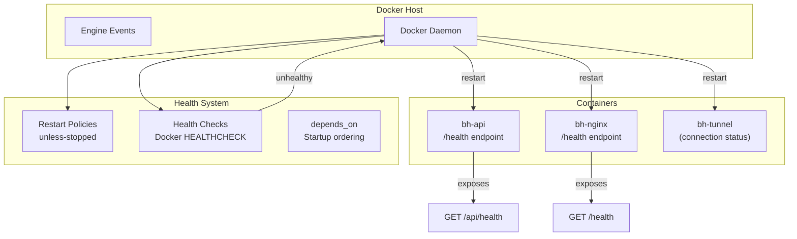
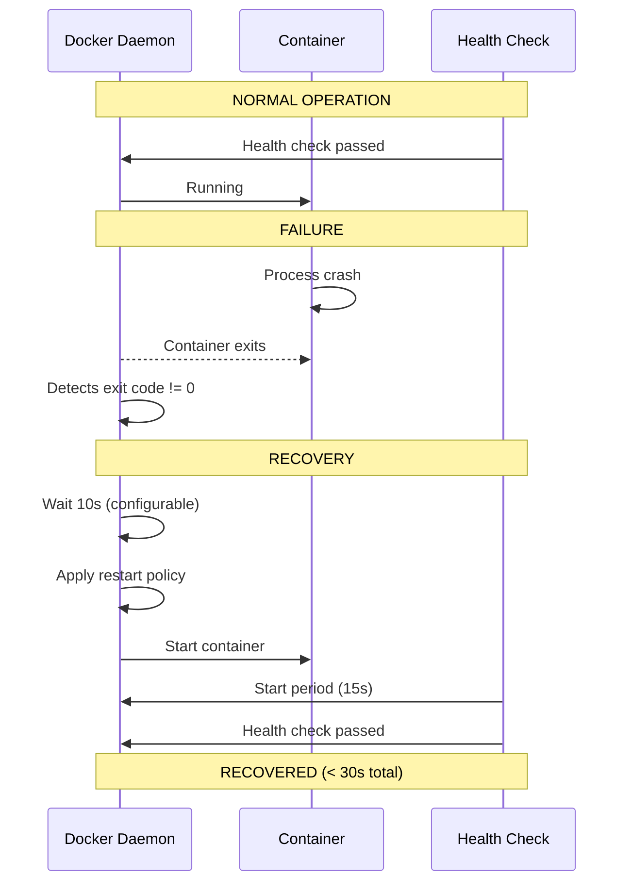

# 19 — Monitoring & Self-Healing

**Status:** Draft  
**Last Updated:** 2026-07-08  
**Owner:** Bharat Bhusal  
**References:** [09 - Deployment Architecture](09-deployment-architecture.md), [11 - Service Architecture](11-service-architecture.md), [28 - Startup Lifecycle](../part-iv-operations/28-startup-lifecycle.md)

---

## Purpose

Describe how BhusalHub monitors its own health, detects failures, and recovers without human intervention.

## Scope

Health monitoring, automatic recovery, alerting, and logging. External monitoring services are out of scope.

## Monitoring Architecture



> **Caption:** Monitoring architecture. Docker's built-in health checks and restart policies are the primary self-healing mechanism.

## Health Checks

### API Health Check

```dockerfile
HEALTHCHECK --interval=30s --timeout=3s --start-period=15s --retries=3 \
  CMD wget --no-verbose --tries=1 --spider http://localhost:8080/api/health || exit 1
```

The `/api/health` endpoint returns:
- `200 OK` with JSON body `{ "status": "healthy", "database": "connected" }`
- `503 Service Unavailable` if database is unreachable or migrations are pending
- Response time under 200 ms

### Nginx Health Check

```dockerfile
HEALTHCHECK --interval=30s --timeout=3s --start-period=10s --retries=3 \
  CMD wget --no-verbose --tries=1 --spider http://localhost:80/health || exit 1
```

### cloudflared Health

`cloudflared` does not have a native health check. The tunnel's status is monitored via:
- Docker's process-level restart policy (if the process crashes, Docker restarts it).
- Optional: `cloudflared metrics` endpoint (exposes tunnel connection status).

## Self-Healing Mechanisms

### Docker Restart Policies

| Container | Policy | Behavior |
|-----------|--------|----------|
| `bh-nginx` | `unless-stopped` | Restarts on crash, not after explicit `docker stop` |
| `bh-api` | `unless-stopped` | Restarts on crash |
| `bh-tunnel` | `unless-stopped` | Restarts on crash, re-establishes tunnel |
| `bh-watchtower` | `unless-stopped` | Restarts on crash |

### Docker Health Checks

If `HEALTHCHECK` returns unhealthy 3 consecutive times, Docker marks the container as unhealthy and triggers a restart. This catches:
- API process running but unable to connect to SQLite.
- Nginx process running but not serving requests.
- Memory leaks or hung processes.

### Startup Order

`depends_on` with `condition: service_healthy` ensures services start in the correct order:

```yaml
services:
  bh-api:
    healthcheck: ...
  bh-nginx:
    depends_on:
      bh-api:
        condition: service_healthy
```

## Failure Recovery Timeline



> **Caption:** Self-healing sequence. Docker detects the crash, applies restart policy, and waits for the health check to pass.

## Logging

All containers log to stdout/stderr (Docker-native). Logs are captured via:

- **Viewing:** `docker logs bh-api`
- **Rotation:** Docker's built-in log rotation (configured in `daemon.json`):

```json
{
  "log-driver": "json-file",
  "log-opts": {
    "max-size": "10m",
    "max-file": "3"
  }
}
```

## Alerting

In Version 1, alerting is minimal:

| Condition | Action |
|-----------|--------|
| Container unhealthy | Docker restarts it (automatic) |
| Disk > 90% full | API logs warning, shown on dashboard |
| Tunnel disconnected | Logged to `cloudflared` logs, visible in tunnel metrics |

No external alerting (email, SMS) in V1. Future versions MAY add:
- Health check failure notifications.
- Disk space alerts.
- Unusual login attempt alerts.

## Dashboard Health Display

The API exposes `GET /api/admin/health` which returns:

```json
{
  "services": {
    "api": { "status": "healthy" },
    "database": { "status": "healthy", "size_mb": 12.4 },
    "storage": { "status": "healthy", "used_gb": 42.1, "total_gb": 2000 }
  },
  "uptime_seconds": 604800,
  "last_backup": "2026-07-07T04:00:00Z"
}
```

## Related Chapters

- [09 - Deployment Architecture](09-deployment-architecture.md)
- [28 - Startup Lifecycle](../part-iv-operations/28-startup-lifecycle.md)
- [33 - Disaster Recovery](../part-iv-operations/33-disaster-recovery.md)
- [34 - Operations Runbook](../part-iv-operations/34-operations-runbook.md)
