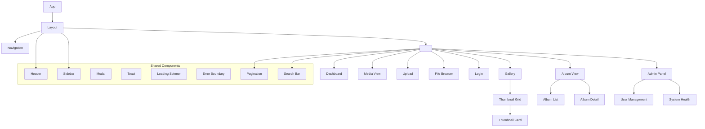

# 20 — Frontend Architecture

**Status:** Draft  
**Last Updated:** 2026-07-08  
**Owner:** Bharat Bhusal  
**References:** [25 - UI Architecture](25-ui-architecture.md), [08 - High-Level Design](../part-ii-architecture/08-high-level-design.md)

---

## Purpose

Describe the frontend application architecture, toolchain, and build process.

## Scope

React + Vite SPA. Component hierarchy, state management, routing, and API communication.

## Frontend Stack

| Layer | Technology | Purpose |
|-------|------------|---------|
| Framework | React 18 | UI components |
| Build tool | Vite 5 | Dev server, production build, HMR |
| Routing | React Router v6 | Client-side routing |
| State management | React Context + hooks | No external state library |
| HTTP client | fetch (native) | API communication |
| Styling | CSS Modules | Component-scoped styles |
| TypeScript | TypeScript 5 | Type safety |
| Testing | Vitest + Testing Library | Unit/integration tests |

## Component Architecture



> **Caption:** Frontend component tree. React Router renders page-level components inside the Layout. Shared components are reused across pages.

## Pages and Routes

| Route | Component | Auth | Description |
|-------|-----------|------|-------------|
| `/login` | Login | No | Authentication page |
| `/` | Dashboard | Yes | System overview, recent uploads |
| `/gallery` | Gallery | Yes | Photo/video grid |
| `/gallery?search=` | Gallery | Yes | Search results |
| `/albums` | AlbumList | Yes | Album listing |
| `/albums/:id` | AlbumDetail | Yes | Album contents |
| `/media/:id` | MediaView | Yes | Single media detail/player |
| `/files` | FileBrowser | Yes | Filesystem browser |
| `/upload` | Upload | Yes | Upload files |
| `/admin/users` | UserMgmt | Admin | User management |
| `/admin/health` | SystemHealth | Admin | System status |

## State Management

No external state library (Redux, Zustand, etc.). State is managed via:

1. **React Context** — Global state (auth status, current user, theme).
2. **URL params** — Page state (search query, pagination, sort order).
3. **Local component state** — UI state (modals, toggles, forms).
4. **Custom hooks** — Encapsulate data fetching and caching.

### Auth Context

```typescript
interface AuthState {
  user: User | null;
  isAuthenticated: boolean;
  login: (username: string, password: string) => Promise<void>;
  logout: () => Promise<void>;
  isLoading: boolean;
}
```

### Data Fetching Pattern

Data fetching uses a custom `useApi` hook that:
- Manages loading/error/data states.
- Handles authentication (attaches session cookie).
- Provides a `refresh()` function for cache invalidation.

```typescript
function useApi<T>(url: string) {
  const [state, setState] = useState<{
    data: T | null;
    isLoading: boolean;
    error: Error | null;
  }>({ data: null, isLoading: true, error: null });

  const fetch = useCallback(async () => {
    try {
      const response = await fetch(url, { credentials: 'include' });
      if (!response.ok) throw new Error(response.statusText);
      const data = await response.json();
      setState({ data, isLoading: false, error: null });
    } catch (error) {
      setState({ data: null, isLoading: false, error });
    }
  }, [url]);

  useEffect(() => { fetch(); }, [fetch]);
  return { ...state, refresh: fetch };
}
```

## Build Configuration

```typescript
// vite.config.ts
export default defineConfig({
  plugins: [react()],
  build: {
    outDir: 'dist',
    sourcemap: false,
    minify: 'esbuild',
    rollupOptions: {
      output: {
        manualChunks: {
          vendor: ['react', 'react-dom', 'react-router-dom'],
        },
      },
    },
  },
  server: {
    proxy: {
      '/api': 'http://localhost:8080',
    },
  },
});
```

## Production Build Output

```
dist/
├── index.html
├── assets/
│   ├── index-{hash}.js          # Application code
│   ├── vendor-{hash}.js         # React + dependencies
│   └── index-{hash}.css         # Compiled styles
```

Total size target: < 200 KB (gzipped).

## Key Design Decisions

| Decision | Rationale |
|----------|-----------|
| No SSR | Static SPA reduces server resource usage. No Node.js in production. |
| CSS Modules over Tailwind | Scoped styles without a large CSS framework dependency. Less JS overhead. |
| fetch over Axios | Native API, no extra dependency. Axios adds ~14 KB gzipped. |
| No cache library | Simple in-memory caching via context. SWR/React Query add complexity. |
| TypeScript | Type safety reduces runtime errors, improves IDE support. |

## Future Improvements

- **Code splitting** — Lazy-load admin pages (not needed in initial bundle).
- **Service worker** — For offline support and faster repeat loads.
- **Virtual scrolling** — For galleries with 10,000+ items.
- **Progressive image loading** — Blur-up placeholders for thumbnails.

## Related Chapters

- [25 - UI Architecture](25-ui-architecture.md)
- [24 - User Journeys](24-user-journeys.md)
- [08 - High-Level Design](../part-ii-architecture/08-high-level-design.md)
