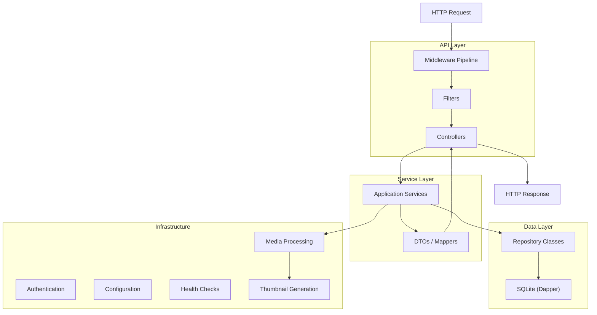

# 21 — Backend Architecture

**Status:** Draft  
**Last Updated:** 2026-07-08  
**Owner:** Bharat Bhusal  
**References:** [08 - High-Level Design](../part-ii-architecture/08-high-level-design.md), [14 - Database Architecture](../part-ii-architecture/14-database-architecture.md), [23 - API Specification](23-api-specification.md)

---

## Purpose

Describe the ASP.NET Core Web API architecture, project structure, and key implementation patterns.

## Scope

Backend project organization, middleware pipeline, controller/service/repository layers, and key implementation details.

## Backend Architecture Layers



> **Caption:** Backend architecture layers. Requests flow through middleware, controllers, services, and data access. Responses flow back through DTOs.

## Project Structure

```
src/backend/
├── BhusalHub.Api/
│   ├── Controllers/
│   │   ├── AuthController.cs
│   │   ├── MediaController.cs
│   │   ├── AlbumsController.cs
│   │   ├── FilesController.cs
│   │   ├── AdminController.cs
│   │   └── HealthController.cs
│   ├── Filters/
│   │   ├── AuthenticationFilter.cs
│   │   └── AdminAuthorizationFilter.cs
│   ├── Middleware/
│   │   ├── ExceptionHandlingMiddleware.cs
│   │   ├── RequestLoggingMiddleware.cs
│   │   └── SessionValidationMiddleware.cs
│   ├── DTOs/
│   │   ├── MediaDto.cs
│   │   ├── UploadResponse.cs
│   │   └── LoginRequest.cs
│   ├── Program.cs
│   └── BhusalHub.Api.csproj
├── BhusalHub.Core/
│   ├── Models/
│   │   ├── Media.cs
│   │   ├── User.cs
│   │   ├── Album.cs
│   │   └── Session.cs
│   ├── Services/
│   │   ├── MediaService.cs
│   │   ├── AlbumService.cs
│   │   ├── AuthService.cs
│   │   ├── ThumbnailService.cs
│   │   └── SearchService.cs
│   ├── Interfaces/
│   │   ├── IMediaService.cs
│   │   ├── IAlbumService.cs
│   │   ├── IAuthService.cs
│   │   └── IThumbnailService.cs
│   └── BhusalHub.Core.csproj
└── BhusalHub.Data/
    ├── Repositories/
    │   ├── MediaRepository.cs
    │   ├── UserRepository.cs
    │   ├── AlbumRepository.cs
    │   └── SessionRepository.cs
    ├── Migrations/
    │   ├── 001_InitialSchema.cs
    │   └── 002_AddTags.cs
    ├── DatabaseInitializer.cs
    └── BhusalHub.Data.csproj
```

## Middleware Pipeline

```csharp
// Program.cs
app.UseMiddleware<ExceptionHandlingMiddleware>();
app.UseMiddleware<RequestLoggingMiddleware>();
app.UseMiddleware<SessionValidationMiddleware>();
app.UseCors();
app.MapControllers();
```

| Middleware | Order | Purpose |
|------------|-------|---------|
| ExceptionHandling | 1st | Catches unhandled exceptions, returns 500 with problem-detail JSON |
| RequestLogging | 2nd | Logs method, path, status, duration |
| SessionValidation | 3rd | Validates session cookie, attaches User to HttpContext |
| CORS | 4th | Allows frontend origin |
| Controllers | Last | Route requests to controllers |

## Controller Pattern

Controllers are thin — they handle HTTP concerns (status codes, request binding) and delegate to services.

```csharp
[ApiController]
[Route("api/media")]
public class MediaController : ControllerBase
{
    private readonly IMediaService _mediaService;

    [HttpGet]
    public async Task<ActionResult<PaginatedResult<MediaDto>>> List(
        [FromQuery] int page = 1,
        [FromQuery] int pageSize = 30)
    {
        var result = await _mediaService.ListAsync(page, pageSize);
        return Ok(result);
    }

    [HttpPost("upload")]
    public async Task<ActionResult<UploadResponse>> Upload(
        IFormFile file)
    {
        var result = await _mediaService.UploadAsync(file, CurrentUser);
        return CreatedAtAction(nameof(Get), new { id = result.Id }, result);
    }
}
```

## Service Layer

Services contain business logic. They are stateless and injectable.

```csharp
public class MediaService : IMediaService
{
    private readonly IMediaRepository _repository;
    private readonly IThumbnailService _thumbnailService;

    public async Task<MediaDto> UploadAsync(IFormFile file, User user)
    {
        // 1. Validate file type and size
        // 2. Generate unique filename
        // 3. Save file to filesystem
        // 4. Generate thumbnail
        // 5. Extract metadata (dimensions, EXIF)
        // 6. Save metadata to database
        // 7. Return DTO
    }
}
```

## Data Access

Dapper over raw ADO.NET for simplicity and performance. No Entity Framework.

```csharp
public class MediaRepository : IMediaRepository
{
    private readonly SqliteConnection _connection;

    public async Task<PagedResult<Media>> ListAsync(int page, int pageSize)
    {
        var sql = @"
            SELECT * FROM Media
            ORDER BY created_at DESC
            LIMIT @Limit OFFSET @Offset";

        var items = await _connection.QueryAsync<Media>(sql, new
        {
            Limit = pageSize,
            Offset = (page - 1) * pageSize
        });

        var total = await _connection.ExecuteScalarAsync<int>(
            "SELECT COUNT(*) FROM Media");

        return new PagedResult<Media>(items, total, page, pageSize);
    }
}
```

## Health Endpoint

```csharp
[ApiController]
[Route("api")]
public class HealthController : ControllerBase
{
    [HttpGet("health")]
    public IActionResult Get()
    {
        try
        {
            _connection.Execute("SELECT 1");
            return Ok(new { status = "healthy", database = "connected" });
        }
        catch
        {
            return StatusCode(503, new { status = "unhealthy", database = "disconnected" });
        }
    }
}
```

## Key Design Decisions

| Decision | Rationale |
|----------|-----------|
| Dapper over EF Core | Better performance, full SQL control. EF adds ~20 MB to the deployment. |
| Manual DI registration | Minimal containers, explicit dependencies. Scrutor/autoregistration adds magic. |
| No repository pattern abstraction for SQLite | Direct Dapper calls are sufficient. Adding IRepository<T> is premature abstraction. |
| Synchronous thumbnail processing | Sequential processing is acceptable for household upload volume (tens per day). A queue is over-engineering until proven necessary. |
| Custom auth over Identity | ASP.NET Core Identity adds ~50 tables and significant complexity. Simple session-based auth is sufficient. |

## Failure Scenarios

| Scenario | Behavior |
|----------|----------|
| DB connection fails | Health check returns 503. API continues running, retries on next request. |
| Disk full during upload | API catches IOException, returns 507, logs error. |
| Thumbnail generation fails | Upload succeeds. Thumbnail is marked as pending and retried. |
| Upload interrupted | Partial file is cleaned up. Client must re-upload. |

## Related Chapters

- [08 - High-Level Design](../part-ii-architecture/08-high-level-design.md)
- [14 - Database Architecture](../part-ii-architecture/14-database-architecture.md)
- [23 - API Specification](23-api-specification.md)
