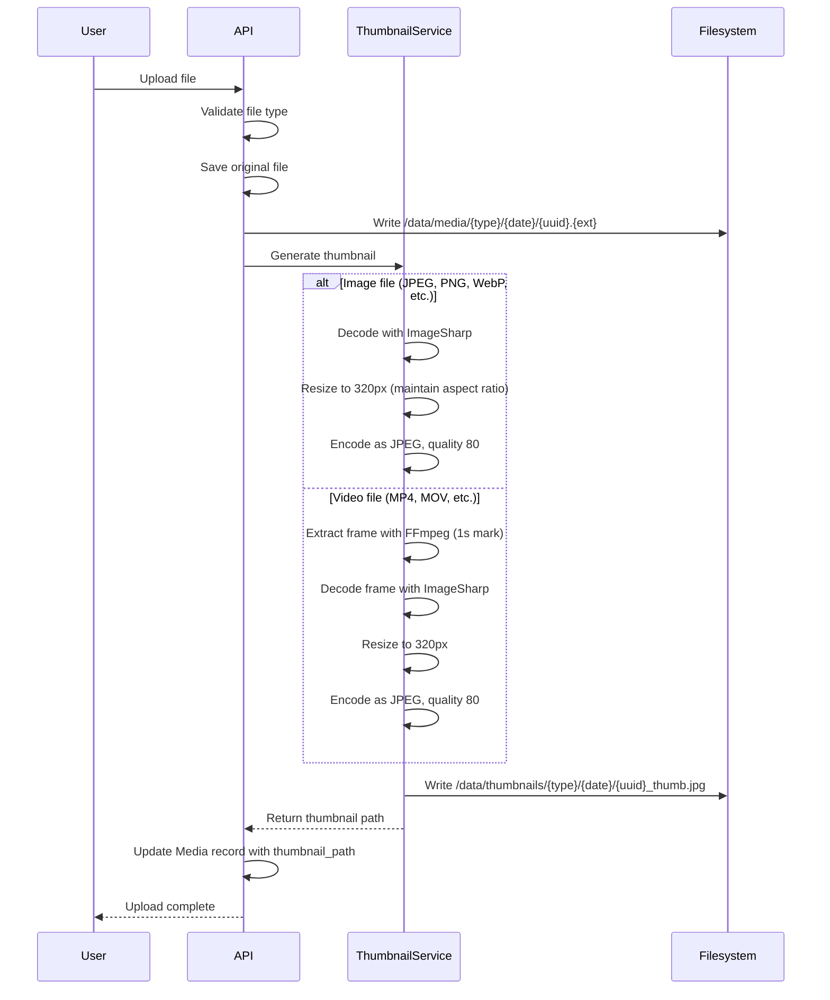

# 22 — Thumbnail Processing

**Status:** Draft  
**Last Updated:** 2026-07-08  
**Owner:** Bharat Bhusal  
**References:** [13 - Storage Architecture](../part-ii-architecture/13-storage-architecture.md), [21 - Backend Architecture](21-backend-architecture.md)

---

## Purpose

Describe how thumbnails are generated for photos and videos, including the processing pipeline, storage strategy, and error handling.

## Scope

Thumbnail generation for uploaded media. Does not cover the frontend display of thumbnails (see [Chapter 20](20-frontend-architecture.md)).

## Thumbnail Pipeline



> **Caption:** Thumbnail generation pipeline. Thumbnails are generated synchronously during upload. Video thumbnails use FFmpeg for frame extraction.

## Image Thumbnail Generation

```csharp
public class ThumbnailService : IThumbnailService
{
    private const int ThumbnailWidth = 320;
    private const int ThumbnailQuality = 80;

    public async Task<string> GenerateImageThumbnailAsync(string sourcePath, string outputDir)
    {
        using var image = await Image.LoadAsync(sourcePath);

        image.Mutate(x =>
        {
            if (image.Width > ThumbnailWidth)
            {
                var ratio = (double)ThumbnailWidth / image.Width;
                var height = (int)(image.Height * ratio);
                x.Resize(ThumbnailWidth, height);
            }
        });

        var thumbnailPath = Path.Combine(outputDir, GetThumbnailFileName(sourcePath));
        await image.SaveAsJpegAsync(thumbnailPath, new JpegEncoder
        {
            Quality = ThumbnailQuality
        });

        return thumbnailPath;
    }
}
```

## Video Thumbnail Generation

```csharp
public async Task<string> GenerateVideoThumbnailAsync(string sourcePath, string outputDir)
{
    var thumbnailPath = Path.Combine(outputDir, GetThumbnailFileName(sourcePath));

    var process = new Process
    {
        StartInfo = new ProcessStartInfo
        {
            FileName = "ffmpeg",
            Arguments = $"-i \"{sourcePath}\" -ss 00:00:01 -vframes 1 " +
                        $"-vf scale={ThumbnailWidth}:-1 \"{thumbnailPath}\" -y",
            RedirectStandardOutput = true,
            RedirectStandardError = true,
            UseShellExecute = false
        }
    };

    process.Start();
    await process.WaitForExitAsync();

    if (process.ExitCode != 0)
        throw new ThumbnailGenerationException("FFmpeg failed");

    return thumbnailPath;
}
```

## Thumbnail Specifications

| Property | Value |
|----------|-------|
| Format | JPEG |
| Max width | 320 pixels |
| Aspect ratio | Maintained (height varies) |
| Quality | 80 (balance of size and quality) |
| File naming | `{uuid}_thumb.jpg` (mirrors original UUID) |
| Directory | `/data/thumbnails/{type}/{year}/{month}/` |

## Storage Impact

| Media | Thumbnail Size (approx) |
|-------|------------------------|
| 12 MP photo (4000x3000) | ~15–25 KB |
| 4K video thumbnail | ~20–30 KB |
| 1080p video thumbnail | ~10–20 KB |

At 100,000 media items, thumbnails consume approximately 2 GB. This is acceptable for a 2 TB drive.

## Error Handling

| Scenario | Behavior |
|----------|----------|
| Image corrupted / invalid | ThumbnailService throws. Upload still succeeds. Media marked `thumbnail_pending`. |
| FFmpeg not found | API startup fails health check. FFmpeg is a REQUIRED dependency. |
| Disk full during thumbnail write | IOException caught. Upload rollback. |
| Thumbnail already exists | Overwritten (idempotent). |

### Retry Strategy

Failed thumbnails are stored with `thumbnail_status = 'pending'`. The dashboard exposes a "Regenerate thumbnails" admin action. Future versions MAY implement automatic retry.

## Dependencies

| Library | Purpose |
|---------|---------|
| SixLabors.ImageSharp | Image decoding, resizing, encoding (.NET native) |
| FFmpeg (external binary) | Video frame extraction (executed via Process) |

Both dependencies are included in the API Docker image:
- ImageSharp: NuGet package.
- FFmpeg: `apt-get install ffmpeg` in Dockerfile.

## Future Improvements

- **Asynchronous processing** — Queue thumbnail jobs for background processing. Deferred until upload volume justifies it.
- **Multiple thumbnail sizes** — Small (150px), medium (320px), large (640px). Deferred; single size is sufficient.
- **WebP thumbnails** — Better compression. Deferred; browser compatibility is sufficient with JPEG.
- **Parallel processing** — Batch regenerate thumbnails concurrently. Not needed for single-file uploads.

## Related Chapters

- [13 - Storage Architecture](../part-ii-architecture/13-storage-architecture.md)
- [21 - Backend Architecture](21-backend-architecture.md)
