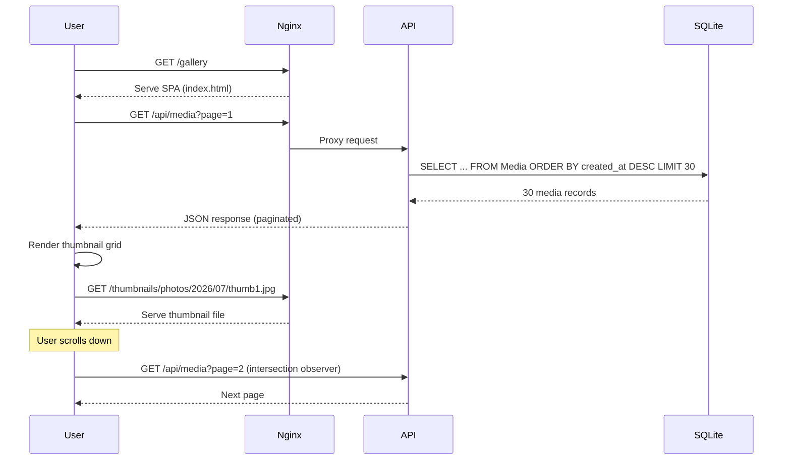
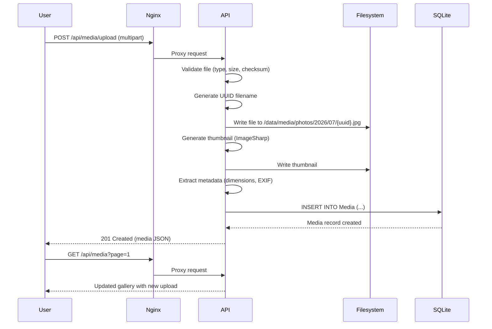
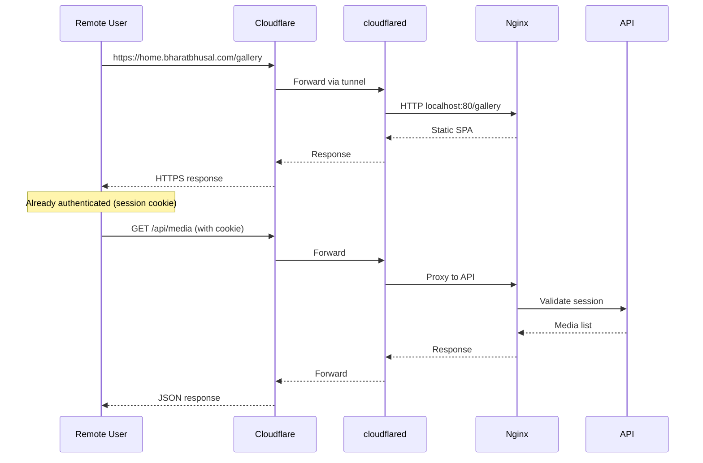
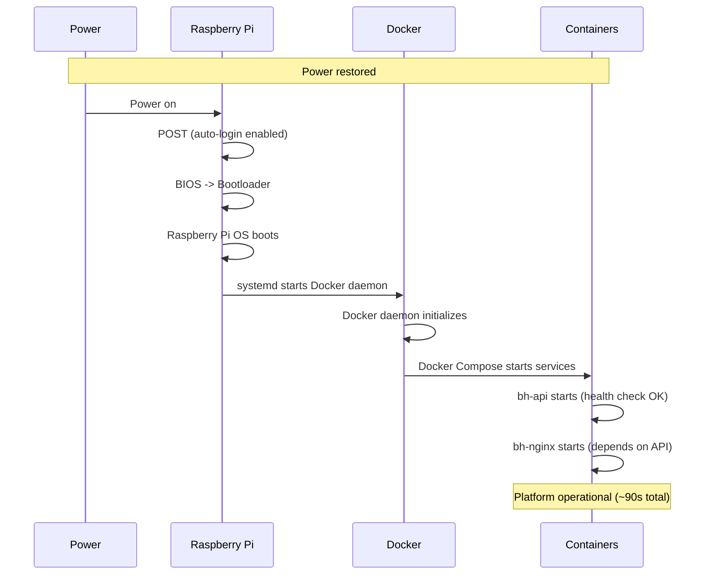
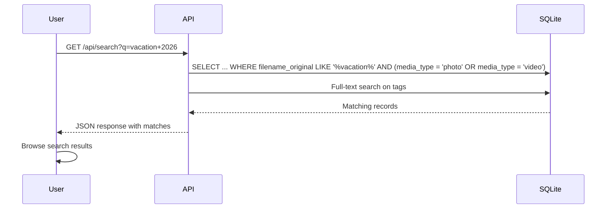
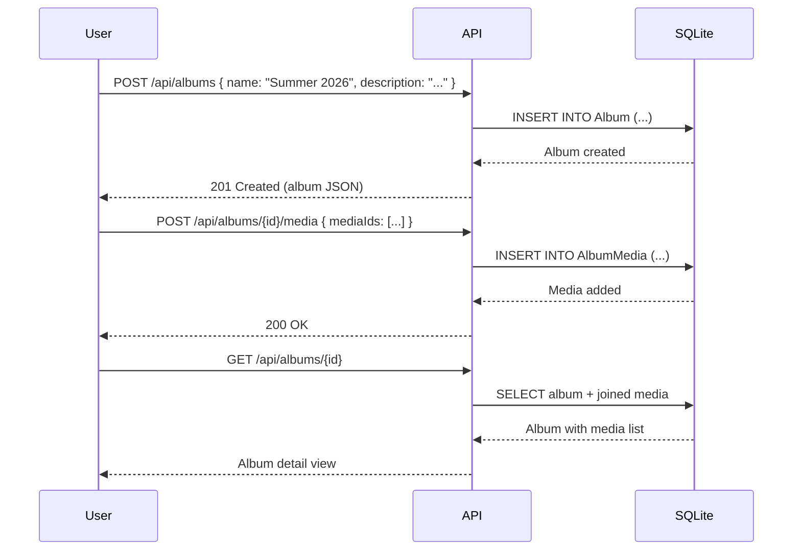

# 24 — User Journeys

**Status:** Draft  
**Last Updated:** 2026-07-08  
**Owner:** Bharat Bhusal  
**References:** [02 - Functional Requirements](../part-i-foundation/02-functional-requirements.md), [23 - API Specification](23-api-specification.md)

---

## Purpose

Document the key user journeys to validate that the architecture supports real-world usage patterns.

## Scope

Primary workflows for Version 1. Edge cases and error states are documented inline.

## Journey 1: Browse Gallery

> **Caption:** Gallery browsing. The SPA loads immediately. Thumbnails are served directly by Nginx. Infinite scroll triggers paginated API calls.

## Journey 2: Upload Media

> **Caption:** Upload flow. The file is validated, stored, thumbnailed, and indexed in a single request.

## Journey 3: Remote Access

> **Caption:** Remote access. The same SPA and API are served via Cloudflare Tunnel. The session cookie persists across requests.

## Journey 4: Power Recovery

> **Caption:** Power recovery sequence. No manual intervention required. The platform is operational within ~90 seconds of power restoration.

## Journey 5: Search Media

> **Caption:** Search flow. The search query is matched against filenames and tags. Results are returned as a paginated list.

## Journey 6: Create Album

> **Caption:** Album creation and population. An album is created first, then media is added in a separate request.

## Related Chapters

- [02 - Functional Requirements](../part-i-foundation/02-functional-requirements.md)
- [23 - API Specification](23-api-specification.md)
