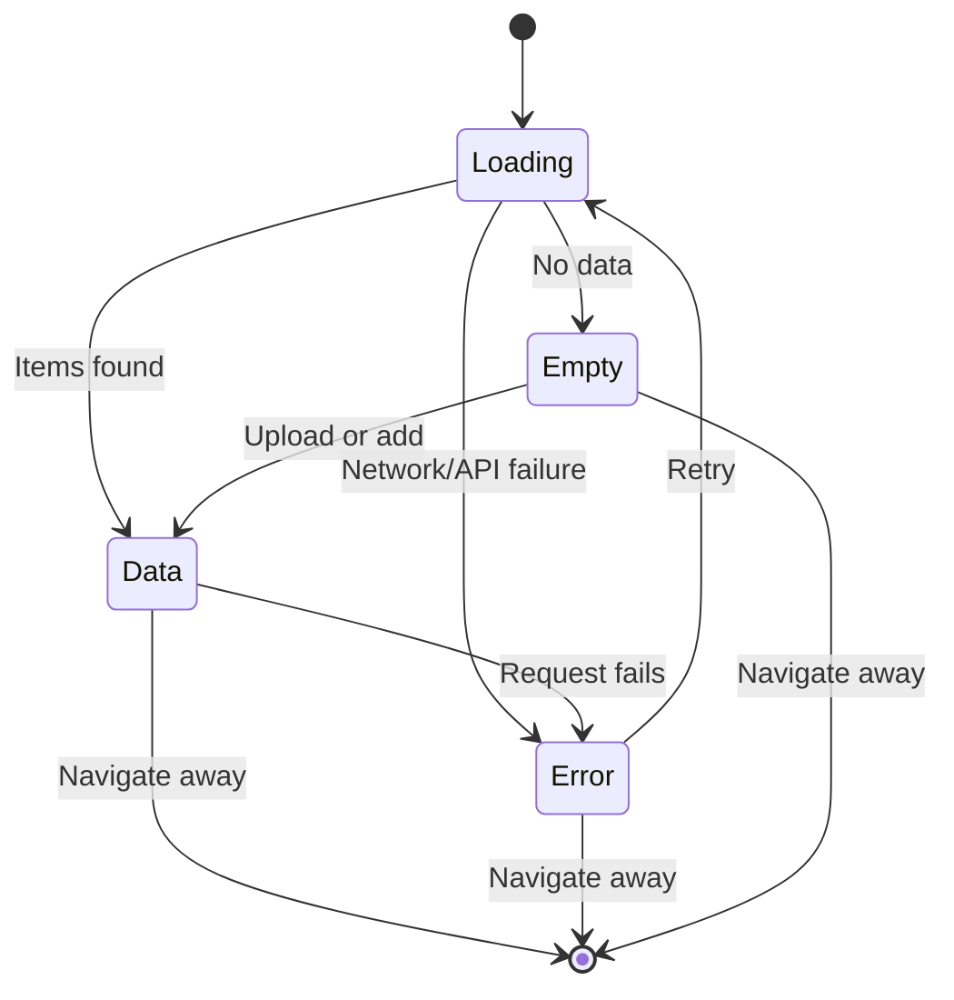
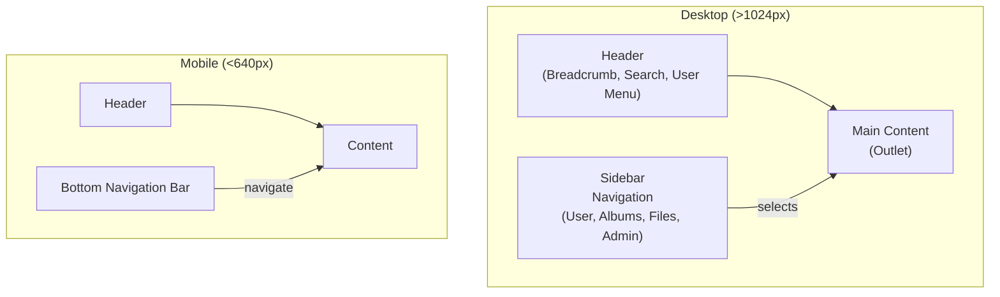

# 25 — UI Architecture

**Status:** Draft  
**Last Updated:** 2026-07-08  
**Owner:** Bharat Bhusal  
**References:** [20 - Frontend Architecture](20-frontend-architecture.md), [24 - User Journeys](24-user-journeys.md)

---

## Purpose

Describe the user interface structure, design patterns, and state management for each UI state.

## Scope

Visual structure, UI state machine, responsive design strategy, and component design patterns.

## UI State Machine



> **Caption:** Every data-driven view implements these four states: loading, empty, data, error. No view should ever show a blank page.

## State Handling Pattern

Every data-fetching component follows this pattern:

```typescript
function GalleryPage() {
  const { data, isLoading, error, refresh } = useApi<Media[]>('/api/media');

  if (isLoading) return <LoadingSpinner />;
  if (error) return <ErrorState message={error.message} onRetry={refresh} />;
  if (!data || data.length === 0) return <EmptyState />;
  return <ThumbnailGrid items={data} />;
}
```

### Component States

| State | Visual | Behavior |
|-------|--------|----------|
| **Loading** | Skeleton screen or spinner | Shown immediately. No layout shift. |
| **Empty** | Illustration + message + action button | "No photos yet. Upload your first photo." |
| **Data** | Content | Normal view with data. |
| **Error** | Error message + retry button | "Something went wrong. [Retry]" |

## Responsive Design

| Breakpoint | Target | Layout |
|------------|--------|--------|
| < 640 px | Mobile | Single column, bottom navigation |
| 640–1024 px | Tablet | 2–3 column grid, sidebar collapsed |
| > 1024 px | Desktop | 4–5 column grid, sidebar visible |

## Layout Structure



> **Caption:** Layout structure for desktop and mobile. On mobile, the sidebar becomes a bottom navigation bar.

## Key UI Patterns

### Thumbnail Grid

- CSS Grid with `auto-fill` and `minmax(200px, 1fr)`.
- Lazy loading via IntersectionObserver.
- Click to open media detail.

### Media Detail / Viewer

- Full-resolution image with zoom (pinch-to-zoom on mobile).
- Video player with HTML5 `<video>` element.
- Metadata sidebar (filename, date, dimensions, EXIF).
- Download button.
- Delete button (with confirmation modal).

### Upload Flow

- Drag-and-drop zone with visual feedback.
- Progress bar per file (XMLHttpRequest `upload.onprogress`).
- Batch upload (multiple files).
- Success/failure summary after upload.

### Search

- Full-width search bar in header.
- Typeahead / live results (debounced, 300 ms).
- Filter chips (type, date range).
- Search results in the gallery grid.

## Component Design Guidelines

| Concern | Guideline |
|---------|-----------|
| Styling | CSS Modules. No CSS-in-JS. |
| Responsiveness | Mobile-first media queries. |
| Accessibility | Semantic HTML, ARIA labels, keyboard navigation. |
| Performance | `React.lazy` for admin routes. Memoize expensive components. |
| Error handling | Error boundaries at page level. |

## Future Improvements

- **Dark mode** — CSS custom properties for theme switching.
- **Keyboard shortcuts** — For power users (navigate, search, delete).
- **Drag-and-drop albums** — Rearrange album contents via drag and drop.
- **Infinite scroll** — Already planned (IntersectionObserver for pagination).

## Related Chapters

- [20 - Frontend Architecture](20-frontend-architecture.md)
- [24 - User Journeys](24-user-journeys.md)
