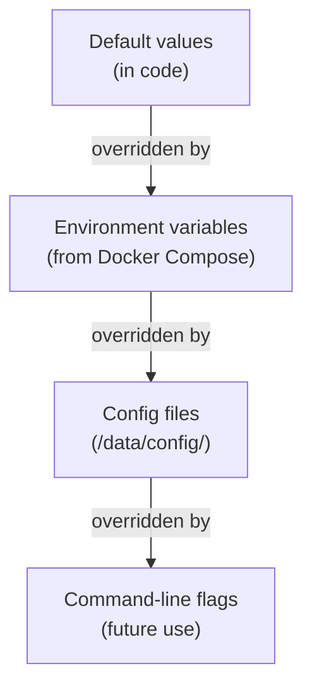

# 26 — Configuration

**Status:** Draft  
**Last Updated:** 2026-07-08  
**Owner:** Bharat Bhusal  
**References:** [Appendix F - Environment Variables](../appendices/f-environment-variables.md), [12 - Docker Architecture](../part-ii-architecture/12-docker-architecture.md)

---

## Purpose

Describe how BhusalHub is configured, including environment variables, configuration files, and the precedence order.

## Scope

Application configuration for all services. Deployment configuration is covered in [Chapter 09](../part-ii-architecture/09-deployment-architecture.md).

## Configuration Philosophy

1. **Environment variables** for runtime configuration.
2. **Files** for complex configuration (Nginx config, TLS certs).
3. **Sensible defaults** for everything — the platform should work with minimal configuration.
4. **No configuration in code** — all environment-specific values are externalized.

## Configuration Precedence



> **Caption:** Configuration precedence. Environment variables override defaults. Config files override environment variables.

## Environment Variables

### API (`bh-api`)

| Variable | Default | Description |
|----------|---------|-------------|
| `BH_DB_PATH` | `/data/db/bhusalhub.db` | SQLite database file path |
| `BH_MEDIA_ROOT` | `/data/media` | Media storage root directory |
| `BH_THUMBNAIL_ROOT` | `/data/thumbnails` | Thumbnail storage root directory |
| `BH_SESSION_EXPIRY_HOURS` | `24` | Session expiration time in hours |
| `BH_SESSION_MAX_HOURS` | `168` | Maximum session lifetime in hours (7 days) |
| `BH_LOG_LEVEL` | `Information` | Logging level (Debug, Information, Warning, Error) |
| `BH_CORS_ORIGINS` | `http://localhost:5173` | Allowed CORS origins (comma-separated) |
| `BH_MAX_UPLOAD_SIZE_MB` | `4096` | Maximum upload file size in MB |
| `ASPNETCORE_URLS` | `http://0.0.0.0:8080` | API listening address |

### Nginx (`bh-nginx`)

Configured via mounted config file, not environment variables.

### Tunnel (`bh-tunnel`)

Configured via mounted config file (`/etc/cloudflared/config.yml`). The tunnel token is also mounted as a file.

## Configuration Files

### `/data/config/env/api.env`

```
BH_DB_PATH=/data/db/bhusalhub.db
BH_MEDIA_ROOT=/data/media
BH_THUMBNAIL_ROOT=/data/thumbnails
BH_LOG_LEVEL=Information
```

### `/data/config/nginx/nginx.conf`

Standard Nginx configuration. Key sections:

```nginx
upstream api {
    server bh-api:8080;
}

server {
    listen 80;
    server_name home.bharatbhusal.com localhost;
    return 301 https://$host$request_uri;
}

server {
    listen 443 ssl;
    server_name home.bharatbhusal.com;

    ssl_certificate /etc/nginx/ssl/cert.pem;
    ssl_certificate_key /etc/nginx/ssl/key.pem;

    location /api/ {
        proxy_pass http://api;
        proxy_set_header Host $host;
        proxy_set_header X-Real-IP $remote_addr;
        proxy_set_header X-Forwarded-For $proxy_add_x_forwarded_for;
    }

    location /thumbnails/ {
        alias /data/thumbnails/;
        expires 30d;
        add_header Cache-Control "public, immutable";
    }

    location / {
        root /usr/share/nginx/html;
        try_files $uri /index.html;
        expires -1;
    }
}
```

### `/data/config/tunnel/config.yml`

```yaml
tunnel: bhusalhub
credentials-file: /etc/cloudflared/credentials.json
ingress:
  - hostname: home.bharatbhusal.com
    service: http://bh-nginx:80
  - service: http_status:404
```

## Docker Compose Integration

```yaml
services:
  bh-api:
    env_file:
      - /mnt/ssd/config/env/api.env
    environment:
      - BH_LOG_LEVEL=Debug  # overrides env_file
```

## Secret Management

| Secret | Storage | Access |
|--------|---------|--------|
| DB path | Env file | Mounted into container |
| TLS private key | `/data/config/ssl/` | Read-only volume, `chmod 600` |
| Tunnel credentials | `/data/config/tunnel/` | Mounted read-only |
| Docker socket | `/var/run/docker.sock` | Mounted only for Watchtower |

**No secrets are hardcoded in Dockerfiles or source code.**

## Related Chapters

- [12 - Docker Architecture](../part-ii-architecture/12-docker-architecture.md)
- [09 - Deployment Architecture](../part-ii-architecture/09-deployment-architecture.md)
- [Appendix F - Environment Variables](../appendices/f-environment-variables.md)
