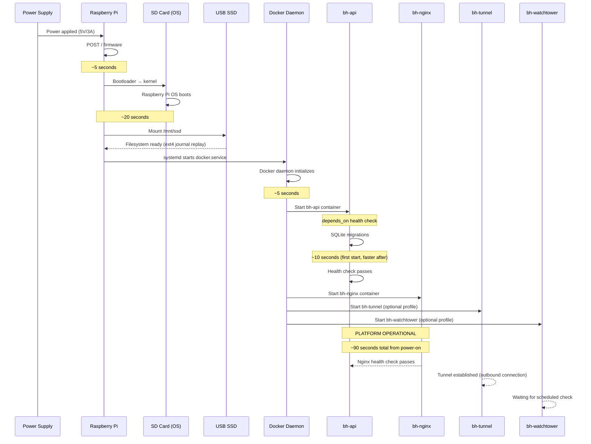
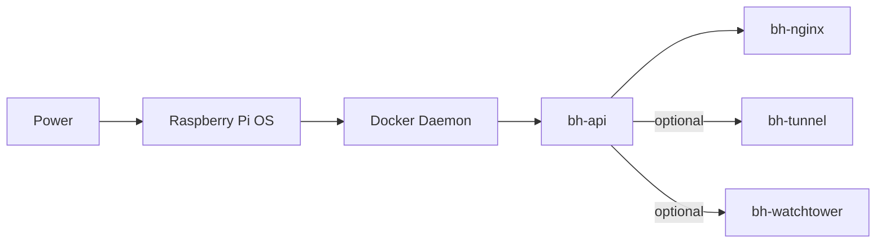

# 28 — Startup Lifecycle

**Status:** Draft  
**Last Updated:** 2026-07-08  
**Owner:** Bharat Bhusal  
**References:** [09 - Deployment Architecture](../part-ii-architecture/09-deployment-architecture.md), [19 - Monitoring & Self-Healing](../part-ii-architecture/19-monitoring-self-healing.md)

---

## Purpose

Describe the complete startup sequence from power-on to fully operational platform, including all dependencies and timing.

## Scope

Startup from cold boot (power loss or shutdown). Does not cover container restarts (see [Chapter 19](../part-ii-architecture/19-monitoring-self-healing.md)).

## Startup Sequence



> **Caption:** Full startup sequence from power-on to operational. Total time target: under 120 seconds from power application.

## Startup Timing Budget

| Phase | Duration | Cumulative |
|-------|----------|------------|
| POST / firmware | 5 s | 5 s |
| OS boot | 20 s | 25 s |
| SSD mount (ext4 journal) | 5 s | 30 s |
| Docker daemon | 5 s | 35 s |
| API start + DB migration | 15 s | 50 s |
| Nginx start + health check | 10 s | 60 s |
| Tunnel establishment | 15 s | 75 s |
| **Total** | **~90 s** | **Target: < 120 s** |

## Startup Dependencies



> **Caption:** Service dependency graph at startup. The API must be healthy before Nginx and optional services start.

## First-Time Startup

On the very first boot (fresh install):

1. API starts with an empty database.
2. API detects no users exist → creates migration tables.
3. API serves `POST /api/setup` endpoint.
4. First user to hit `/api/setup` creates the admin account.
5. After admin user is created, `/api/setup` returns 404.
6. Normal startup resumes.

## Automatic Startup (Power Restoration)

| Component | Mechanism |
|-----------|-----------|
| Raspberry Pi | `auto_boot=true` in config.txt (always on when powered) |
| Docker daemon | systemd service, enabled by default |
| Containers | `restart: unless-stopped` in docker-compose.yml |
| SSD mount | `/etc/fstab` entry with `noauto,x-systemd.automount` |

### fstab Entry

```
/dev/sda1  /mnt/ssd  ext4  defaults,noatime,nodiratime  0  2
```

## Failure Scenarios

| Scenario | Behavior | Recovery |
|----------|----------|----------|
| SSD not detected | Docker volumes fail → containers exit | Manual check: `lsblk`, `dmesg` |
| DB migration failure | API health check fails → Nginx 502 | Manual fix: restore DB backup, fix migration |
| Docker daemon fails | No containers start | systemd restart: `systemctl restart docker` |
| Tunnel fails to connect | Tunnel container exits (restart loop) | Auto-retry via Docker restart policy |
| Network unavailable | All services start, tunnel fails | Local access works immediately |

## Related Chapters

- [09 - Deployment Architecture](../part-ii-architecture/09-deployment-architecture.md)
- [19 - Monitoring & Self-Healing](../part-ii-architecture/19-monitoring-self-healing.md)
- [33 - Disaster Recovery](33-disaster-recovery.md)
