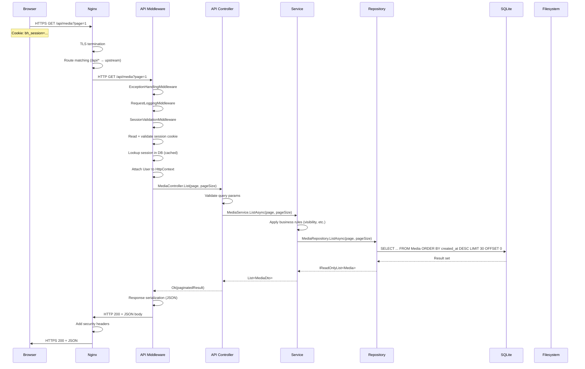
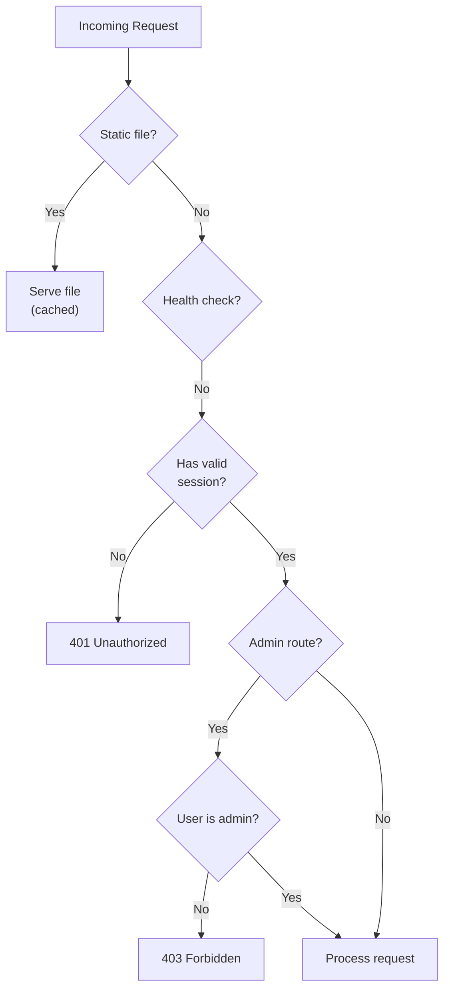

# 29 — Request Lifecycle

**Status:** Draft  
**Last Updated:** 2026-07-08  
**Owner:** Bharat Bhusal  
**References:** [08 - High-Level Design](../part-ii-architecture/08-high-level-design.md), [15 - Authentication](../part-ii-architecture/15-authentication.md), [21 - Backend Architecture](../part-iii-development/21-backend-architecture.md)

---

## Purpose

Trace a complete HTTP request through all layers of the BhusalHub stack, from browser to database and back.

## Scope

The full request lifecycle for a typical authenticated API call. Static file serving has a shorter path.

## Request Flow (API Call)



> **Caption:** Full request lifecycle. The request passes through three Nginx stages, three middleware components, controller, service, and repository layers before reaching SQLite.

## Request Types and Paths

### Static File (HTML/CSS/JS)

```
Browser → Nginx (443) → Nginx (static root) → File → Browser
```

### Thumbnail / Uploaded File

```
Browser → Nginx (443) → Nginx (alias /data/thumbnails) → Filesystem → Browser
```

### API Request

```
Browser → Nginx (443) → Nginx (proxy_pass) → API Middleware → Controller → Service → Repository → SQLite → Response
```

## Middleware Pipeline

| Order | Middleware | Responsibility | On Exception |
|-------|-----------|----------------|--------------|
| 1 | ExceptionHandling | Catch all unhandled exceptions, return RFC 7807 problem detail | Responds with 500 |
| 2 | RequestLogging | Log method, path, status, duration | Logs error, re-throws to #1 |
| 3 | SessionValidation | Validate cookie, lookup user | Sets anonymous user, skips auth |
| 4 | CORS | Allow frontend origin | — |
| 5 | Controllers | Route + handle request | — |

## Authentication Check



> **Caption:** Authentication and authorization decision tree for every request.

## Performance Hot Paths

| Path | Frequency | Optimization |
|------|-----------|--------------|
| Thumbnail serving | Highest | Nginx direct serving, `Cache-Control: public, immutable`, 30-day expiry |
| Gallery listing | High | SQLite index on `created_at`, pagination (30 items) |
| Media detail | Medium | Single-row lookup by PK |
| Upload | Low | Single synchronous write + thumbnail generation |
| Search | Low | SQLite `LIKE` query (full-text search deferred) |

## Related Chapters

- [08 - High-Level Design](../part-ii-architecture/08-high-level-design.md)
- [15 - Authentication](../part-ii-architecture/15-authentication.md)
- [30 - Performance](30-performance.md)
