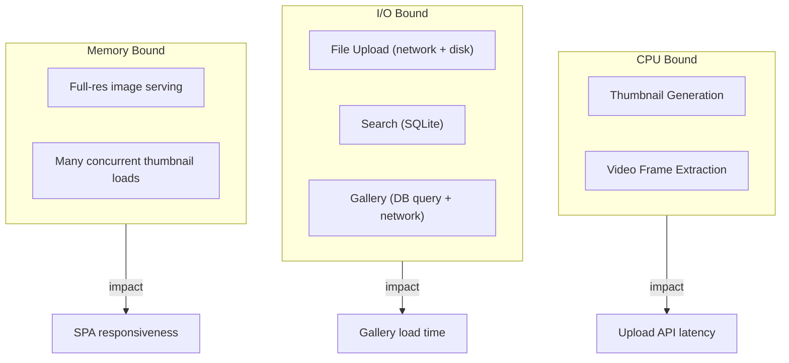

# 30 — Performance

**Status:** Draft  
**Last Updated:** 2026-07-08  
**Owner:** Bharat Bhusal  
**References:** [03 - Non-Functional Requirements](../part-i-foundation/03-non-functional-requirements.md), [31 - Raspberry Pi Optimization](31-raspberry-pi-optimization.md)

---

## Purpose

Document the performance characteristics of BhusalHub, including expected throughput, latency targets, and bottlenecks.

## Scope

Performance of the deployed platform on Raspberry Pi 4B (2 GB). Development machine performance may differ.

## Performance Targets

| Metric | Target | Measurement Method |
|--------|--------|--------------------|
| Gallery page load (30 thumbnails) | < 2 s (cold), < 500 ms (warm) | Browser DevTools |
| API response time (p95) | < 500 ms | API middleware timing |
| Thumbnail generation (image) | < 1 s per image | Application log |
| Video thumbnail extraction | < 3 s per video | Application log |
| File upload throughput | > 10 MB/s | Network monitoring |
| Search query | < 3 s | Query execution time |
| SQLite query (simple select) | < 10 ms | Query execution time |
| SQLite query (search LIKE) | < 3 s | Query execution time |

## Bottleneck Analysis

> **Caption:** Bottleneck analysis. CPU is the primary constraint on RPi 4B, followed by disk I/O.

## Optimization Strategies

### 1. Nginx-Level Caching

| Asset | Cache Header | Expiry |
|-------|-------------|--------|
| Thumbnails | `Cache-Control: public, immutable` | 30 days |
| SPA build (index.html) | `Cache-Control: no-cache` | Revalidate |
| SPA assets (JS/CSS) | `Cache-Control: public, immutable` | 1 year (content-hashed) |
| API responses | `Cache-Control: no-store` | Never |

### 2. SQLite Optimization

- WAL mode for concurrent read/write.
- Indexes on all query-filtered columns.
- `mmap_size = 256 MB` for memory-mapped I/O.
- `cache_size = 8000` pages (8 MB).

### 3. Thumbnail Generation

- 320 px width — sufficient for gallery grids, minimal CPU per image.
- JPEG quality 80 — good visual quality at ~60% size of quality 100.
- Synchronous generation — acceptable for household upload volume.
- Video thumbnails extracted at 1-second mark (fastest seek).

### 4. Upload Throughput

Maximum upload throughput is limited by:
- Gigabit Ethernet (125 MB/s theoretical, ~100 MB/s real).
- USB 3.0 SSD write speed (~150–300 MB/s).
- Nginx `client_max_body_size` (4 GB).

Real-world throughput target: 10–30 MB/s for a single upload stream.

## Memory Budget

| Service | Reserved | Limit | Typical |
|---------|----------|-------|---------|
| bh-api | 128 MB | 256 MB | 80–150 MB |
| bh-nginx | 32 MB | 64 MB | 15–30 MB |
| bh-tunnel | 32 MB | 64 MB | 15–20 MB |
| bh-watchtower | 16 MB | 32 MB | 10–15 MB |
| OS + Docker | — | — | ~300 MB |
| **Total** | **~200 MB reserved** | **~416 MB** | **~450 MB typical** |

Typical total usage: ~450 MB. Headroom: ~1.5 GB for peak loads.

## Load Testing

Target load for V1:

| Scenario | Load | Expected Behavior |
|----------|------|-------------------|
| Gallery browsing | 3 users, scrolling | < 500 ms per page |
| Upload | 1 user, large files | > 10 MB/s |
| Concurrent browsing + upload | 2 browsing, 1 uploading | Slight gallery delay (< 1 s) |
| Thumbnail regeneration | Admin action | Sequential processing. ~1 s per 100 images. |

## Performance Regression Testing

- Every API endpoint MUST complete within 2x the target time on a RPi 4B.
- CI pipeline includes a `--performance` test flag (runs on x86_64, not RPi).
- Manual performance verification on RPi before major releases.

## Related Chapters

- [03 - Non-Functional Requirements](../part-i-foundation/03-non-functional-requirements.md)
- [31 - Raspberry Pi Optimization](31-raspberry-pi-optimization.md)
