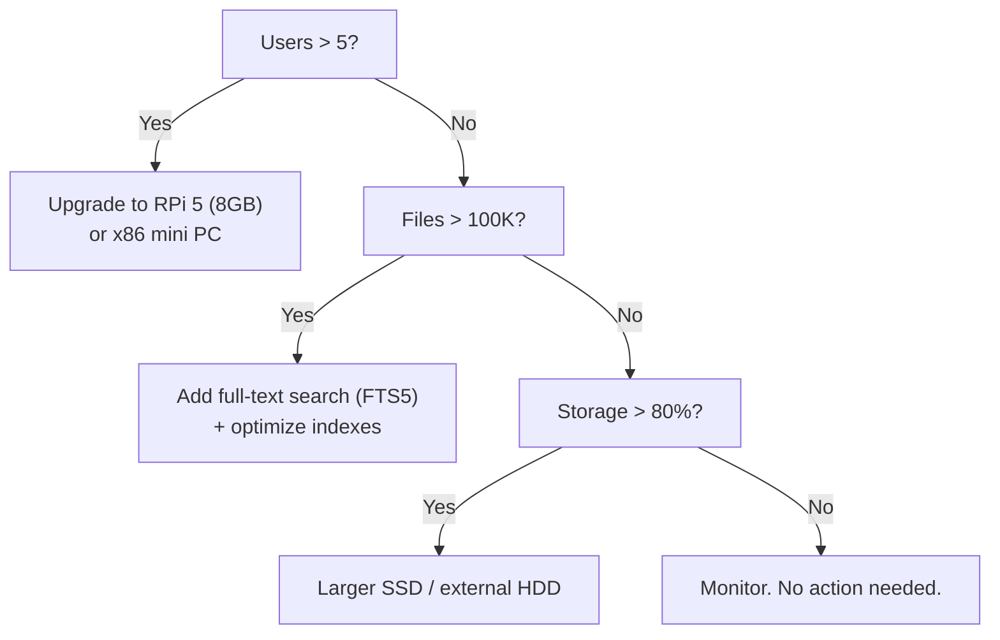

# 32 — Scalability

**Status:** Draft  
**Last Updated:** 2026-07-08  
**Owner:** Bharat Bhusal  
**References:** [30 - Performance](30-performance.md), [31 - Raspberry Pi Optimization](31-raspberry-pi-optimization.md)

---

## Purpose

Document the scalability characteristics of BhusalHub, including current limits and upgrade paths.

## Scope

Scalability within the target hardware (RPi 4B, 2 GB RAM) and the path to larger hardware.

## Current Limits

| Dimension | Limit | Bottleneck |
|-----------|-------|------------|
| Concurrent users | 3–5 | RAM (2 GB total) |
| Media library | ~100,000 files | SQLite index size, disk I/O |
| Single file size | 4 GB | Nginx `client_max_body_size` |
| Total storage | 2 TB | USB SSD capacity |
| Upload throughput | ~30 MB/s | USB 3.0 + SSD write speed |
| Thumbnail generation | ~3,600 images/hour (sequential) | CPU (single core) |

## When to Scale

> **Caption:** Decision tree for when to scale. The RPi 4B handles the target workload. Upgrade triggers are based on measured saturation, not speculation.

## Horizontal Scaling

BhusalHub is designed as a single-node system. Horizontal scaling (multiple Pis) is intentionally excluded from V1 for these reasons:

- **Complexity** — Multi-node adds networking, coordination, and data distribution complexity.
- **Over-engineering** — A single RPi 5 or x86 mini PC handles the target workload.
- **Data locality** — Media files benefit from local storage. Distributed storage adds latency.

If horizontal scaling becomes necessary (not anticipated), it would require:

1. Shared database (PostgreSQL or SQLite replication).
2. Shared storage (NFS or MinIO).
3. Load balancer in front of multiple API instances.
4. Session affinity or shared session store (Redis).

This is documented for future reference, not for implementation.

## Vertical Scaling Path

| Step | Hardware | RAM | Storage | Users |
|------|----------|-----|---------|-------|
| 1 (current) | RPi 4B | 2 GB | 2 TB SSD | 3 |
| 2 | RPi 4B | 4 GB* | 2 TB SSD | 5 |
| 3 | RPi 5 | 8 GB | 4 TB SSD | 10 |
| 4 | x86 NUC/mini PC | 16+ GB | 8 TB+ | 20+ |

*\*RPi 4B has a 2 GB and 4 GB variant. The 2 GB version is the minimum target.*

## Software Scaling

### SQLite Scaling

SQLite handles the target workload comfortably. At 100,000 media records:

- Database size: ~50 MB (metadata only).
- Index size: ~20 MB.
- Simple queries (by PK, by date): < 10 ms.
- LIKE searches: < 3 s (acceptable for household use).

For larger libraries, full-text search (FTS5) can be added without changing the database engine.

### Thumbnail Scaling

Sequential thumbnail generation scales linearly. On RPi 4B:

| Images | Time (sequential) | Acceptable? |
|--------|-------------------|-------------|
| 10 | ~10 s | Yes |
| 100 | ~100 s | Yes (background job) |
| 1,000 | ~17 min | Maybe (batch operation) |
| 10,000 | ~2.8 hours | No (needs parallel processing) |

At scale, parallel thumbnail generation with `Parallel.ForEach` or a job queue would be needed. Deferred until the sequential approach is proven insufficient.

## Related Chapters

- [30 - Performance](30-performance.md)
- [31 - Raspberry Pi Optimization](31-raspberry-pi-optimization.md)
- [36 - Future Extensions](../part-v-future/36-future-extensions.md)
