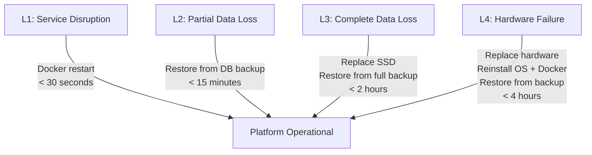

# 33 — Disaster Recovery

**Status:** Draft  
**Last Updated:** 2026-07-08  
**Owner:** Bharat Bhusal  
**References:** [13 - Storage Architecture](../part-ii-architecture/13-storage-architecture.md), [14 - Database Architecture](../part-ii-architecture/14-database-architecture.md), [19 - Monitoring & Self-Healing](../part-ii-architecture/19-monitoring-self-healing.md)

---

## Purpose

Define recovery procedures for various disaster scenarios, from minor service disruption to complete hardware failure.

## Scope

Data loss, hardware failure, corruption scenarios, and recovery procedures. Daily operations are covered in [Chapter 34](34-operations-runbook.md).

## Disaster Classification

| Level | Description | Examples |
|-------|-------------|----------|
| L1 | Service disruption | Container crash, tunnel down |
| L2 | Partial data loss | Database corruption, accidental deletion |
| L3 | Complete data loss | SSD failure, filesystem corruption |
| L4 | Hardware failure | RPi failure, PSU failure, SD card corruption |

## Recovery Timeline



> **Caption:** Recovery timelines by disaster level. Most failures are L1 and self-healing.

## Backup Strategy

### Database Backup

Run daily via cron:

```bash
#!/bin/bash
# /infra/scripts/backup.sh
BACKUP_DIR="/mnt/ssd/backups/db"
DB_PATH="/mnt/ssd/db/bhusalhub.db"
DATE=$(date +%Y-%m-%d)

mkdir -p "$BACKUP_DIR"
sqlite3 "$DB_PATH" ".backup '$BACKUP_DIR/bhusalhub-$DATE.db'"

# Keep 30 days of backups
find "$BACKUP_DIR" -name "bhusalhub-*.db" -mtime +30 -delete
```

Cron schedule: `0 4 * * * /infra/scripts/backup.sh`

### Full System Backup

The entire `/mnt/ssd` directory is the backup unit. Recommended tools:
- `rsync` to an external drive or another machine on the LAN.
- Manual: `cp -a /mnt/ssd /backup/location/`.

### What Gets Backed Up

| Path | Priority | Backup Frequency | Notes |
|------|----------|-----------------|-------|
| `/mnt/ssd/db/` | Critical | Daily | Non-regenerable metadata |
| `/mnt/ssd/config/` | High | Per change | Version-controlled in repo |
| `/mnt/ssd/media/` | Medium | Weekly | Large, can be re-ripped from original sources |
| `/mnt/ssd/thumbnails/` | Low | Monthly | Regenerable from media |

## Recovery Procedures

### L1: Container Crash

1. Docker restarts automatically (health check + restart policy).
2. If container fails to start: `docker logs bh-api` to investigate.
3. Fix issue (config, permissions, etc.) and restart: `docker compose restart bh-api`.

### L2: Database Corruption

1. Stop the API: `docker compose stop bh-api`.
2. Restore from latest backup:
   ```bash
   cp /mnt/ssd/backups/db/bhusalhub-2026-07-07.db /mnt/ssd/db/bhusalhub.db
   ```
3. Start the API: `docker compose start bh-api`.
4. Verify health: `curl http://localhost:8080/api/health`.

### L2: Accidental File Deletion

1. If deleted recently, check if the file was in the `media/` directory.
2. Restore from filesystem backup (rsync destination or external drive).
3. The database record may still exist (orphaned). Delete the record from the admin panel.

### L3: SSD Failure

1. Replace SSD.
2. Format with ext4.
3. Mount at `/mnt/ssd`.
4. Restore `/mnt/ssd/db/` from backup.
5. Restore `/mnt/ssd/config/` from backup or git.
6. Run thumbnail regeneration for media files.
7. Start services: `docker compose up -d`.

### L4: SD Card Failure

1. Flash a new SD card with Raspberry Pi OS Lite.
2. Install Docker + Docker Compose.
3. Mount SSD (data is on the SSD, intact).
4. Start services: `docker compose up -d`.
5. Total downtime: ~1 hour (mostly flashing + config).

### L4: Complete Hardware Failure

1. Acquire replacement RPi (or use a different machine).
2. Flash SD card with OS.
3. Install Docker + Compose.
4. Connect SSD.
5. Copy `infra/compose/` and `infra/scripts/` from git.
6. Run `docker compose up -d`.
7. Configure router DNS.
8. Set up Cloudflare Tunnel (new tunnel token).

## Prevention

| Risk | Mitigation |
|------|------------|
| Database corruption | WAL mode, nightly backups |
| SSD failure | Monitor SMART status, regular backups |
| SD card failure | No application data on SD card (boot only) |
| Accidental deletion | Confirmation dialogs in UI, database backups |
| Power loss | SQLite WAL, ext4 journaling |
| Fire/theft | Off-site backups (manual, not automated) |

## Related Chapters

- [13 - Storage Architecture](../part-ii-architecture/13-storage-architecture.md)
- [14 - Database Architecture](../part-ii-architecture/14-database-architecture.md)
- [34 - Operations Runbook](34-operations-runbook.md)
