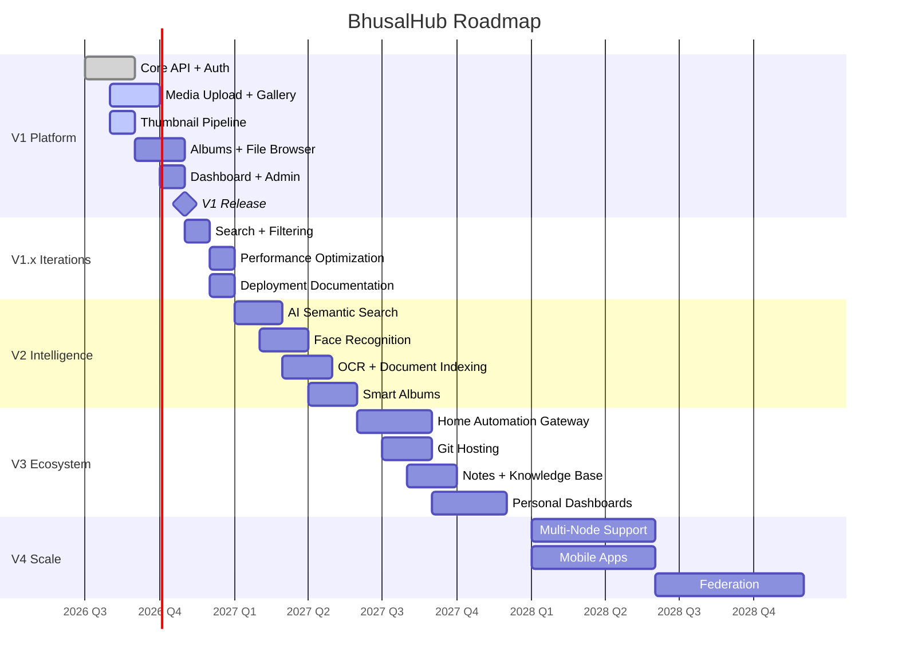

# 35 — Roadmap

**Status:** Draft  
**Last Updated:** 2026-07-08  
**Owner:** Bharat Bhusal  
**References:** [01 - Vision](../part-i-foundation/01-vision.md), [36 - Future Extensions](36-future-extensions.md)

---

## Purpose

Define the planned evolution of BhusalHub across major versions. This roadmap is a living document and will change as priorities shift.

## Scope

High-level milestones and capabilities. Detailed implementation plans are in individual ADRs.

## Roadmap Timeline

> **Caption:** BhusalHub roadmap. Version 1 focuses on core media platform. Later versions add intelligence, ecosystem, and scale.

## V1 — Platform Foundation

**Target:** 2026 Q4

| Capability | Priority | Status |
|------------|----------|--------|
| Authentication (local) | P0 | Planned |
| Media upload (photos + videos) | P0 | Planned |
| Gallery view | P0 | Planned |
| Thumbnail generation | P0 | Planned |
| Albums | P1 | Planned |
| File browser | P1 | Planned |
| Dashboard | P1 | Planned |
| Admin panel | P1 | Planned |
| Search (filename) | P2 | Planned |
| Docker Compose deployment | P0 | Planned |
| Nginx reverse proxy | P0 | Planned |
| Split DNS | P0 | Planned |
| Cloudflare Tunnel | P0 | Planned |
| Self-healing | P0 | Planned |

## V1.x — Iterations

**Target:** 2026 Q4 – 2027 Q1

- Full-text search (FTS5).
- Performance profiling and optimization.
- Deployment documentation and setup scripts.
- Bug fixes from V1 launch.

## V2 — Intelligence

**Target:** 2027 H1

- AI-powered semantic media search (CLIP or similar).
- Face recognition and person-based albums.
- OCR for document images and PDFs.
- Auto-tagging and smart albums.
- Object detection for photo organization.

## V3 — Ecosystem

**Target:** 2027 H2

- Home Automation integration (Home Assistant).
- Git hosting (Gitea/Forgejo container).
- Notes and knowledge management.
- Personal dashboards with widgets.
- Calendar integration.

## V4 — Scale

**Target:** 2028

- Multi-node support (read replicas).
- Native mobile applications (iOS/Android).
- Federation with other instances.
- Public sharing with access controls.

## Related Chapters

- [01 - Vision](../part-i-foundation/01-vision.md)
- [36 - Future Extensions](36-future-extensions.md)
